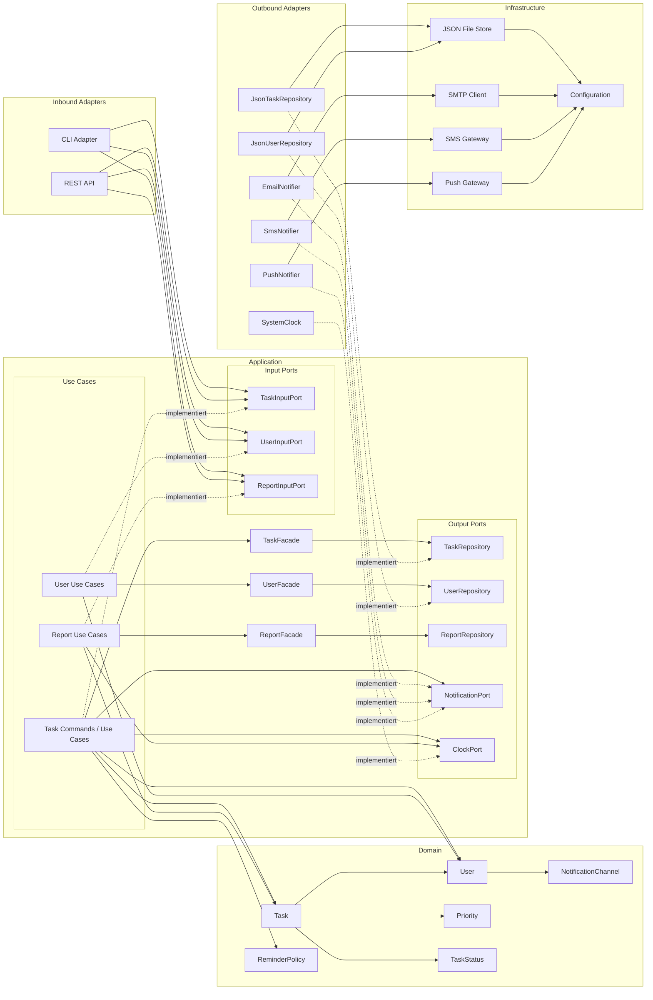

# 0. Inhaltsverzeichnis
- [1 Verletzung von architektonischen Prinzipien](#1-verletzung-von-architektonischen-prinzipien)
  - [1.1 Verletzung SOLID, Testbarkeit, Architektur und Modellierung im Überblick](#11-verletzung-solid-testbarkeit-architektur-und-modellierung-im-überblick)
    - [1.1.1 Schwere Verletzungen](#111-schwere-verletzungen)
    - [1.1.2 Mittelschwerwiegende Verletzungen](#112-mittelschwerwiegende-verletzungen)
    - [1.1.3 Leichte Verletzungen](#113-leichte-verletzungen)
    - [1.1.4 Architektonische Empfehlungen](#114-architektonische-empfehlungen)
  - [1.2 Fünf SOLID Verletzungen im Detail](#12-fünf-solid-verletzungen-im-detail)
    - [1.2.1 Single Responsibility Principle bei `task_manager.py` verletzt](#121-single-responsibility-principle-bei-task_managerpy-verletzt)
    - [1.2.2 Single Responsibility Principle bei `database.py` verletzt](#122-single-responsibility-principle-bei-databasepy-verletzt)
    - [1.2.3 Open/Closed Principle bei `report_generator.py` verletzt](#123-openclosed-principle-bei-report_generatorpy-verletzt)
    - [1.2.4 Liskov Substitution Principle bei `user_types.py` verletzt](#124-liskov-substitution-principle-bei-user_typespy-verletzt)
    - [1.2.5 Dependency Inversion Principle bei `task_manager.py` verletzt](#125-dependency-inversion-principle-bei-task_managerpy-verletzt)

- [2 Architektur](#2-architektur)
  - [2.1 Wahl eines Architekturmodells](#21-wahl-eines-architekturmodells)
    - [2.1.1 Warum Hexagonal?](#211-warum-hexagonal)
    - [2.1.2 Warum kein MVC?](#212-warum-kein-mvc)
    - [2.1.3 Warum keine Schichtenarchitektur?](#213-warum-keine-schichtenarchitektur)
    - [2.1.4 Warum keine Microservices?](#214-warum-keine-microservices)
    - [2.1.5 Warum keine EDA?](#215-warum-keine-eda)
  - [2.2 Schichtendiagramm](#22-schichtendiagramm)
  - [2.3 Ports und Interfaces](#23-ports-und-interfaces)

- [3 Refactoring](#3-refactoring)
  - [3.1 Behebung der 5 SOLID-Verletzung](#31-behebung-der-5-solid-verletzung)
    - [3.1.1 Single Responsibility Principle bei `task_manager.py` verletzt](#311-single-responsibility-principle-bei-task_managerpy-verletzt)
    - [3.1.2 Single Responsibility Principle bei `database.py` verletzt](#312-single-responsibility-principle-bei-databasepy-verletzt)
    - [3.1.3 Open/Close Principle bei `report_generator.py` ist verletzt](#313-openclose-principle-bei-report_generatorpy-ist-verletzt)
    - [3.1.4 Liskov Substitution Principle bei `user_types.py` verletzt](#314-liskov-substitution-principle-bei-user_typespy-verletzt)
    - [3.1.5 Dependency Inversion Principle bei `task_manager.py` verletzt](#315-dependency-inversion-principle-bei-task_managerpy-verletzt)
  - [3.2 Einsatz von mehreren Mustern (3)](#32-einsatz-von-mehreren-mustern-3)
    - [3.2.1 Umsetzung des Strategy Patterns für Benachrichtigungen](#321-umsetzung-des-strategy-patterns-für-benachrichtigungen)
    - [3.2.2 Umsetzung des Facade Patterns für die Datenbank](#322-umsetzung-des-facade-patterns-für-die-datenbank)
    - [3.2.3 Umsetzung des Command Patterns für Task Manager](#323-umsetzung-des-command-patterns-für-task-manager)
  - [3.3 ADRs für Refactoring anhand SOLID-Korrektur und Patterns](#33-adrs-für-refactoring-anhand-solid-korrektur-und-patterns)
    - [ADR-001: Einführung einer hexagonalen Architektur](#adr-001-einführung-einer-hexagonalen-architektur)
    - [ADR-002: Verwendung des Command Patterns für Aufgabenaktionen](#adr-002-verwendung-des-command-patterns-für-aufgabenaktionen)
    - [ADR-003: Verwendung des Strategy Patterns für Benachrichtigungskanäle](#adr-003-verwendung-des-strategy-patterns-für-benachrichtigungskanäle)
    - [ADR-004: Verwendung des Facade Patterns für den Datenzugriff](#adr-004-verwendung-des-facade-patterns-für-den-datenzugriff)
  - [3.4 Neue Features (3)](#34-neue-features-3)
    - [3.4.1 Historisierung von Tasks](#341-historisierung-von-tasks)
    - [3.4.2 Export von Dateien](#342-export-von-dateien)
    - [3.4.3 Authentifizierungs Service](#343-authentifizierungs-service)

- [4 QS](#4-qs)
  - [4.1 Unit-Tests (3)](#41-unit-tests-3)
    - [4.1.1 Prüfung für nichtexistente Status und Überprüfung ob Status aktualisieren funktioniert](#411-prüfung-für-nichtexistente-status-und-überprüfung-ob-status-aktualisieren-funktioniert)
    - [4.1.2 Prüfung, ob neu erstellte Tasks im Daily Report berücksichtigt werden](#412-prüfung-ob-neu-erstellte-tasks-im-daily-report-berücksichtigt-werden)
    - [4.1.3 Prüfung ob man User löschen bzw. deaktivieren kann](#413-prüfung-ob-man-user-löschen-bzw-deaktivieren-kann)
  - [4.2 Integrationstests bzw. Tests für Kernlogik](#42-integrationstests-bzw-tests-für-kernlogik)
    - [4.2.1 Test für Erstellung eines Admins über CLI](#421-test-für-erstellung-eines-admins-über-cli)
    - [4.2.2 Test für Erstellung eines Reports über REST](#422-test-für-erstellung-eines-reports-über-rest)
    - [4.2.3 Test für Löschen eines Tasks über REST](#423-test-für-löschen-eines-tasks-über-rest)
  - [4.3 Fitness Functions](#43-fitness-functions)
    - [Test, um sicherzustellen, dass Schichtabhängigkeiten nach innen zeigen](#test-um-sicherzustellen-dass-schichtabhängigkeiten-nach-innen-zeigen)
    - [Test für zyklische Importe](#test-für-zyklische-importe)
    - [Test damit Entry Points keine Infrastructure/Outbound-Adapter direkt nutzen](#test-damit-entry-points-keine-infrastructureoutbound-adapter-direkt-nutzen)
    - [Fakes](#fakes)


# 1 Verletzung von architektonischen Prinzipien

## 1.1 Verletzung SOLID, Testbarkeit, Architektur und Modellierung im Überblick


---
### 1.1.1 Schwere Verletzungen
| Kategorie               | Datei              | Klasse               | Grund                          | Beschreibung                                                                          | Wartbarkeitseinschränkung                        |
| ----------------------- | ------------------ | -------------------- | ------------------------------ | ------------------------------------------------------------------------------------- | ------------------------------------------------ | 
| Architektur / Schichten | `task_manager.py`  | `TaskManager`        | Direkte DB-Zugriffe            | Verletzt Schichtenarchitektur, Geschäftslogik ist an Infrastruktur gekoppelt.         | Sehr schlechte Testbarkeit und hohe Kopplung     | 
| SOLID (SRP)             | `task_manager.py`  | `TaskManager`        | Mehrere Verantwortlichkeiten   | Verantwortlich für Businesslogik, Datenbank, Benachrichtigung und Benutzerverwaltung. | Änderungen betreffen viele Bereiche gleichzeitig | 
| SOLID (DIP)             | `task_manager.py`  | `TaskManager`        | Direkte Abhängigkeiten         | Arbeitet direkt mit `Database` und `EmailService`.                                    | Keine Austauschbarkeit, schwierige Tests         | 
| Architektur             | `email_service.py` | `EmailService`       | Direkte externe Abhängigkeiten | SMTP wird direkt verwendet.                                                           | Schlechte Testbarkeit                            | 
| UML                     | `notifications.py` | `NotificationCenter` | Hohe Kopplung                  | Direkte Abhängigkeit zu `EmailService`.                                               | Schlechte Erweiterbarkeit                        | 
| SOLID (SRP)             | `database.py`      | `Database`           | Mehrere Verantwortlichkeiten   | Verwaltung von Tasks und Usern in einer Klasse.                                       | Erschwerte Wartung                               | 
| Architektur             | `main.py`          | -                    | Fehlende Modularisierung       | Keine saubere Paketstruktur.                                                          | Schlechte Skalierbarkeit                         | 
| TDD                     | mehrere Dateien    | -                    | Fehlende Unit Tests            | Keine Tests für Kernklassen.                                                          | Änderungen bergen hohes Risiko                   | 
| TDD                     | `task_manager.py`  | `TaskManager`        | Viele Seiteneffekte            | `create_task()` führt mehrere Operationen gleichzeitig aus.                           | Schwer testbar                                   | 
| Architektur             | `task_manager.py`  | `TaskManager`        | Fat Controller                 | Enthält zu viel Geschäftslogik.                                                       | Geringe Wartbarkeit                              | 

---
### 1.1.2 Mittelschwerwiegende Verletzungen


| Kategorie   | Datei                 | Klasse                      | Grund                                      | Beschreibung                                             | Wartbarkeitseinschränkung  | 
| ----------- | --------------------- | --------------------------- | ------------------------------------------ | -------------------------------------------------------- | -------------------------- | 
| UML         | `report_generator.py` | `ReportGenerator`           | Direkte Database-Abhängigkeit              | Initialisiert Datenbank selbst.                          | Schlechte Testbarkeit      | 
| UML         | `task_manager.py`     | `TaskManager`               | Direkte Notification-Abhängigkeit          | NotificationCenter wird direkt erzeugt.                  | Erschwerte Erweiterbarkeit | 
| UML         | `task_manager.py`     | `TaskManager`               | Direkte EmailService-Abhängigkeit          | Direkte Initialisierung.                                 | Hohe Kopplung              | 
| UML         | mehrere               | -                           | Fehlende Interfaces                        | Keine Abstraktionen für Datenbank oder Benachrichtigung. | Schlechte Austauschbarkeit | 
| SOLID (OCP) | `report_generator.py` | `ReportGenerator`           | Nicht erweiterbar                          | Neue Berichtstypen benötigen Codeänderungen.             | Schlechte Erweiterbarkeit  | 
| SOLID (ISP) | `email_service.py`    | `EmailService`              | Zu breite Schnittstelle                    | Clients benötigen nicht alle Funktionen.                 | Unnötige Abhängigkeiten    | 
| SOLID (LSP) | `user_types.py`       | `AdminUser`, `ReadOnlyUser` | Basisklassenvertrag verletzt               | Unterklassen verändern erwartetes Verhalten.             | Unerwartete Fehler         | 
| Architektur | `task_manager.py`     | `TaskManager`               | Repository Pattern fehlt                   | Direkter DB-Zugriff statt Repository.                    | Schlechte Testbarkeit      | 
| Architektur | `report_generator.py` | `ReportGenerator`           | Separation of Concerns verletzt            | Formatierung und Businesslogik vermischt.                | Erschwerte Wartung         | 
| TDD         | `report_generator.py` | `ReportGenerator`           | Fehlende Integrationstests                 | Berichte werden nicht validiert.                         | Fehler werden spät erkannt | 
| TDD         | mehrere               | -                           | Business-Logik mit Infrastruktur vermischt | Schlechte Testbarkeit                                    | Wartungsaufwand steigt     | 

---
### 1.1.3 Leichte Verletzungen

| Kategorie | Datei      | Klasse | Grund                   | Beschreibung                        | Wartbarkeitseinschränkung |
| --------- | ---------- | ------ | ----------------------- | ----------------------------------- | ------------------------- |
| TDD       | `utils.py` | -      | Fehlende Tests          | Utility-Funktionen sind ungetestet. | Erhöhtes Fehlerrisiko     |
| SOLID     | mehrere    | -      | Kleinere SOLID-Verstöße | Verbesserungspotenzial              | Begrenzter Einfluss       | 

---
### 1.1.4 Architektonische Empfehlungen

| Empfehlung        | Datei/Klasse                | Nutzen                                               |
| ----------------- | --------------------------- | ---------------------------------------------------- | 
| Strategy Pattern  | `NotificationCenter`        | Neue Benachrichtigungskanäle ohne `if/else` ergänzen |
| Builder Pattern   | `TaskManager.create_task()` | Übersichtlichere Objekterzeugung                     | 
| Decorator Pattern | `EmailService`              | Logging/Retry flexibel ergänzen                      | 
| Singleton         | `Database`                  | Gemeinsame Datenbankinstanz                          | 
| Facade Pattern    | `TaskManager`               | Geringere Kopplung der Subsysteme                    | 
| Adapter Pattern   | `UserManager`               | Einfachere Integration externer Systeme              | 
| Command Pattern   | `TaskManager`               | Undo/Redo und bessere Nachvollziehbarkeit            |


## 1.2 Fünf SOLID Verletzungen im Detail:
### 1.2.1 Single Responsibility Principle bei `task_manager.py` verletzt

- **Grund:** Eine Klasse hat zu viele Verantwortlichkeiten gegenüber anderen Klassen.
- **Wartbarkeit:** Änderungen an einer Verantwortlichkeit können unbeabsichtigt Auswirkungen auf andere Funktionen haben. Die Klasse wird dadurch schwerer verständlich, schwieriger zu testen und aufwendiger zu erweitern.
- **Severity:** **High**, da der `TaskManager` eine zentrale Klasse ist und viele Komponenten von ihr abhängen.

---

### 1.2.2 Single Responsibility Principle bei `database.py` verletzt

- **Grund:** `database.py` hat mehrere Verantwortlichkeiten: Laden und Speichern sowohl von Usern als auch von Tasks.
- **Wartbarkeit:** Änderungen an der Benutzerverwaltung können unbeabsichtigt die Task-Verwaltung beeinflussen und umgekehrt. Die Klasse wächst mit jeder neuen Funktion weiter an und wird zunehmend schwer wartbar.
- **Severity:** **High**, da die Datenbankklasse eine zentrale Komponente der Anwendung ist.

---

### 1.2.3 Open/Closed Principle bei `report_generator.py` verletzt

- **Grund:** Für neue Berichtsarten muss die Klasse geändert werden.
- **Wartbarkeit:** Jede Erweiterung erfordert Änderungen am bestehenden Code. Dadurch steigt das Risiko, bereits funktionierende Berichte unbeabsichtigt zu beeinflussen oder Fehler einzuführen.
- **Severity:** **Medium**, da die Funktionalität eingeschränkt erweiterbar ist, die Kernfunktion der Anwendung jedoch weiterhin funktioniert.

---

### 1.2.4 Liskov Substitution Principle bei `user_types.py` verletzt

- **Grund:** Unterklassen sind nicht immer kompatibel mit der Basisklasse.
- **Wartbarkeit:** Entwickler können sich nicht darauf verlassen, dass Unterklassen überall dort eingesetzt werden können, wo die Basisklasse erwartet wird. Das erschwert die Wiederverwendbarkeit und erhöht den Testaufwand.
- **Severity:** **Medium**, da fehlerhaftes Verhalten erst zur Laufzeit auftreten kann und die Klassenhierarchie schwerer verständlich wird.

---

### 1.2.5 Dependency Inversion Principle bei `task_manager.py` verletzt

- **Grund:** High-Level-Module hängen von Low-Level-Modulen ab. `TaskManager` initialisiert die Klassen `Database` und `NotificationCenter` direkt und bekommt sie nicht durch eine Abstraktion bereitgestellt.

- **Wartbarkeit:** Änderungen an `Database` oder `NotificationCenter` können direkte Anpassungen am `TaskManager` erforderlich machen. Außerdem wird das Testen erschwert, da Mock-Objekte oder alternative Implementierungen nicht einfach eingesetzt werden können.

- **Severity:** **High**, da die hohe Kopplung die Erweiterbarkeit und Testbarkeit der zentralen Geschäftslogik erheblich einschränkt.

# 2 Architektur 
In diesem Kapitel wird anhand der innerhalb der Vorlesung beigebrachten Inhalte
die Architektur des Projektes neubestimmt. Ziel ist die Architektur anhand beigebrachter Modelle und gängiger Muster zu
verbessern.

## 2.1 Wahl eines Architekturmodells
Zur Auswahl standen diverse Architekturmodelle. Wir haben uns für eine klar geteilte hexagonale Architektur
entschieden. Im Endeffekt kann jede Architektur entschieden gewählt werden, Architekturansätze wie EDA und Microservice 
können in abgewandelter Form als zusätzliche Architekturabstraktion genutzt werden.

### 2.1.1 Warum Hexagonal?
Die hexagonale Architektur erlaubt es, Komponenten auszutauschen. 
Das JsonTaskRepository, das in einer Umsetzung vonnöten wäre, kann zum Beispiel durch MSSQLTaskRepository ersetzt werden. 
Ohne dabei die Klassen mit der Geschäftslogik umzuschreiben. 
Des Weiteren wird durch die hexagonale Architektur SOLID besser eingehalten, denn High-Level-Komponenten hängen von 
Abstraktionen statt von technischen Klassen ab und DIP wird durch Ports umgesetzt. Ebenfalls können mehrere Eingabekanäle
ermöglicht werden, indem Use-Cases definiert und an die Eingabekanäle übergeben werden. 

Wie in Kapitel 4 demonstriert, ermöglicht die hexagonale Architektur eine gute Testbarkeit mithilfe von Fake- oder Mock-Repositories,
ohne dabei die echte Infrastruktur zu verwenden.

### 2.1.2 Warum kein MVC?
MVC eignet sich hauptsächlich zur Trennung von Benutzeroberfläche, Steuerung und Datenmodell. 
Unser Projekt benötigt jedoch vor allem eine klare Trennung zwischen Geschäftslogik und technischen Komponenten wie Datenhaltung und Benachrichtigungen. 
Die hexagonale Architektur bietet dafür mit Ports und Adaptern eine passendere Struktur und ermöglicht eine bessere Austauschbarkeit dieser Komponenten.

### 2.1.3 Warum keine Schichtenarchitektur?
Eine klassische Schichtenarchitektur wäre grundsätzlich möglich, 
trennt Geschäftslogik und technische Komponenten jedoch weniger konsequent. 
Die hexagonale Architektur macht diese Trennung durch explizite Ports und Adapter deutlicher. 
Das passt besser zu unserem Ziel, beispielsweise Datenhaltung und Benachrichtigungen austauschbar zu halten.

### 2.1.4 Warum keine Microservices?
Microservices wären für die Größe des Projekts unnötig komplex. 
Sie würden zusätzliche Probleme wie Service-Kommunikation, 
Deployment und verteilte Datenhaltung mit sich bringen.
Die benötigte Trennung der Komponenten lässt sich innerhalb einer einzelnen Anwendung mit der hexagonalen Architektur 
einfacher erreichen.

### 2.1.5 Warum keine EDA?
Eine Event-Driven Architecture eignet sich besonders für Systeme mit vielen asynchronen und voneinander unabhängigen Abläufen. 
Unser Projekt besteht hauptsächlich aus direkten Abläufen wie dem Erstellen, Speichern und Bearbeiten von Aufgaben. 
Eine EDA würde deshalb zusätzliche Komplexität schaffen, ohne einen wesentlichen Vorteil zu bieten.

## 2.2 Schichtendiagramm
Das Diagramm wurde anhand der Library Mermaid modelliert. Die darausfolgenden Refactorings wurden wie gefordert anhand 
von ADRs im Kapitel 3 notiert.

## 2.3 Ports und Interfaces

| Port | Beschreibung | Verwaltet |
|---|---|---|
| `TaskInputPort` | Definiert die von außen aufrufbaren Funktionen für die Aufgabenverwaltung. | Aufgaben |
| `UserInputPort` | Definiert die von außen aufrufbaren Funktionen für die Benutzerverwaltung. | Benutzer |
| `ReportInputPort` | Definiert die von außen aufrufbaren Funktionen für die Berichterstellung. | Berichte |
| `TaskRepository` | Definiert den Zugriff auf die persistierten Aufgabendaten. | Aufgaben |
| `UserRepository` | Definiert den Zugriff auf die persistierten Benutzerdaten. | Benutzer |
| `ReportRepository` | Definiert den Zugriff auf gespeicherte Berichte und Berichtsdaten. | Berichte |
| `NotificationsPort` | Definiert die Schnittstelle zum Versenden von Benachrichtigungen über verschiedene Kanäle. | Benachrichtigungen |
| `ClockPort` | Stellt der Anwendung eine abstrahierte Schnittstelle für Datum und Uhrzeit bereit. | Zeit / Datum |

# 3 Refactoring

## 3.1 Behebung der 5 SOLID - Verletzung

Oben wurden sich 5 SOLID‑Verletzungen im Detail angesehen. 
Folgend werden 5 Verletzungen mit Sourcecode behoben. Die Fixes bestehen in sich selber und sind unabhängige Vorschläge, jedoch können sie in anderen Kapiteln, sofern notiert, als Ausgangslage vorliegen. Sie betrachten einzelne Fixes für die jeweiligen Klassen und nicht eine Klasse, wo alle Fehler auf einmal behoben werden. Die Einzelbetrachtungen sollen zeigen, dass die Ursache des Problems verstanden wurde und auch verstanden wurde, wie diese zu beheben ist.

### 3.1.1 Single Responsibility Principle bei task_manager.py verletzt
`task_manager.py` hat aktuell Methoden, die nicht nur für das Verwalten von Aufgaben wichtig sind. 
Beispielsweise besitzt die Datei die Methoden `set_reminder` und `find_overdue`, welche die Logik zum Ermitteln überfälliger Aufgaben sowie das Versenden von Erinnerungen übernehmen. 
Diese Verantwortlichkeiten gehören jedoch nicht zur eigentlichen Aufgabenverwaltung.
Auch die Methode `format_task` kann ausgelagert werden, da sie keine CRUD-relevante Aufgabe übernimmt und nur von der Methode Main aufgerufen wird. 


### Vorher
```python
from datetime import datetime, timedelta
from database import Database
from email_service import EmailService
from notifications import NotificationCenter
from user import UserManager
from logger import log, log_error, log_info, log_warning


class TaskManager:
    def __init__(self):
        self.db = Database()
        self.email = EmailService()
        self.notif = NotificationCenter()
        self.users = UserManager()
        self.cnt = 0

    def create_task(self, tid, title, desc, prio, assignee_id, due=None, mode=1):
        if title is None or title == "":
            log_error("Titel darf nicht leer sein")
            return False
        if prio < 1 or prio > 3:
            log_error("Prioritaet muss zwischen 1 und 3 liegen")
            return False

        t = {
            "id": tid,
            "title": title,
            "desc": desc,
            "priority": prio,
            "status": "new",
            "assignee": assignee_id,
            "created": str(datetime.now()),
            "due": due,
        }

        ok = self.db.save_task(tid, t)
        if not ok:
            return False

        u = self.users.get_user(assignee_id)
        if u is not None:
            if prio == 1:
                subject = "Neue Aufgabe (niedrig)"
            elif prio == 2:
                subject = "Neue Aufgabe (mittel)"
            elif prio == 3:
                subject = "Neue Aufgabe (hoch)"
            else:
                subject = "Neue Aufgabe"

            body = "Dir wurde eine neue Aufgabe zugewiesen: " + title

            if mode == 1:
                self.notif.notify(u, "email", subject, body)
            elif mode == 2:
                self.notif.notify(u, "sms", subject, body)
            elif mode == 3:
                self.notif.notify(u, "both", subject, body)
            elif mode == 4:
                self.notif.notify(u, "all", subject, body)

        self.cnt = self.cnt + 1
        log_info("Task " + str(tid) + " erstellt (Anzahl: " + str(self.cnt) + ")")
        return True

    def update_status(self, tid, new_status):
        t = self.db.get_task(tid)
        if t is None:
            log_error("Task nicht gefunden")
            return False

        if new_status not in ["new", "in_progress", "done", "cancelled"]:
            log_error("Unbekannter Status: " + str(new_status))
            return False

        old = t["status"]
        t["status"] = new_status
        self.db.save_task(tid, t)

        if new_status == "done":
            u = self.users.get_user(t["assignee"])
            if u is not None:
                self.notif.notify(
                    u, "email", "Aufgabe erledigt", "Die Aufgabe '" + t["title"] + "' ist erledigt."
                )

        log_info("Task " + str(tid) + ": " + old + " -> " + new_status)
        return True

    def delete_task(self, tid):
        t = self.db.get_task(tid)
        if t is None:
            return False
        self.db.delete_task(tid)
        log_warning("Task " + str(tid) + " geloescht")
        return True

    def get_task(self, tid):
        return self.db.get_task(tid)

    def all_tasks(self):
        return self.db.all_tasks()

    def format_task(self, tid):
        t = self.db.get_task(tid)
        if t is None:
            return "??"
        s = "#" + str(t["id"]) + " " + t["title"]
        if t["priority"] == 1:
            s = s + " [niedrig]"
        elif t["priority"] == 2:
            s = s + " [mittel]"
        elif t["priority"] == 3:
            s = s + " [hoch]"
        s = s + " (" + t["status"] + ")"
        return s

    def find_overdue(self):
        r = []
        for k in self.db.all_tasks():
            t = self.db.all_tasks()[k]
            if t.get("due") is None:
                continue
            if t["status"] == "done" or t["status"] == "cancelled":
                continue
            try:
                due = datetime.fromisoformat(t["due"])
            except:
                continue
            if due < datetime.now():
                r.append(t)
        return r

    def send_reminders(self):
        overdue = self.find_overdue()
        for t in overdue:
            u = self.users.get_user(t["assignee"])
            if u is None:
                continue
            if t["priority"] == 3:
                self.notif.notify_urgent(
                    u, "all", "Aufgabe ueberfaellig", "Die Aufgabe '" + t["title"] + "' ist ueberfaellig!"
                )
            elif t["priority"] == 2:
                self.notif.notify(
                    u, "both", "Aufgabe ueberfaellig", "Die Aufgabe '" + t["title"] + "' ist ueberfaellig."
                )
            else:
                self.notif.notify(
                    u, "email", "Aufgabe ueberfaellig", "Die Aufgabe '" + t["title"] + "' ist ueberfaellig."
                )
```
### Nachher

#### `task_manager.py`

```python
from datetime import datetime
from database import Database
from user import UserManager
from logger import log_error, log_info, log_warning
from reminder_service import ReminderService
from task_formatter import TaskFormatter

class TaskManager:
    def __init__(self):
        self.database = Database()
        self.user_manager = UserManager()
        self.reminder_service = ReminderService(self.database, self.user_manager)
        self.task_formatter = TaskFormatter()
        self.created_task_count = 0

    def create_task(self, task_id, title, description, priority, assignee_id, due=None):
        if not title:
            log_error("Titel should not be empty")
            return False

        if priority not in (1, 2, 3):
            log_error("Priority needs to be between 1 and 3")
            return False

        task = {
            "id": task_id,
            "title": title,
            "desc": description,
            "priority": priority,
            "status": "new",
            "assignee": assignee_id,
            "created": str(datetime.now()),
            "due": due,
        }

        if not self.database.save_task(task_id, task):
            return False

        self.created_task_count += 1
        log_info(f"Task {task_id} created (Amount: {self.created_task_count})")
        return True

    def update_status(self, task_id, new_status):
        task = self.database.get_task(task_id)

        if task is None:
            log_error("Task not found")
            return False

        if new_status not in ["new", "in_progress", "done", "cancelled"]:
            log_error("unknown status")
            return False

        old_status = task["status"]
        task["status"] = new_status
        self.database.save_task(task_id, task)

        log_info(f"Task {task_id}: {old_status} -> {new_status}")
        return True

    def delete_task(self, task_id):
        if self.database.get_task(task_id) is None:
            return False

        self.database.delete_task(task_id)
        log_warning(f"Task {task_id} deleted")
        return True

    def get_task(self, task_id):
        return self.database.get_task(task_id)

    def all_tasks(self):
        return self.database.all_tasks()
```

#### `reminder_service.py`

```python
from datetime import datetime
from notifications import NotificationCenter

class ReminderService:
    def __init__(self, database, user_manager):
        self.database = database
        self.user_manager = user_manager
        self.notification_center = NotificationCenter()

    def find_overdue(self):
        overdue_tasks = []

        for task in self.database.all_tasks().values():
            if task.get("due") is None:
                continue

            if task["status"] in ["done", "cancelled"]:
                continue

            try:
                due_date = datetime.fromisoformat(task["due"])
            except ValueError:
                continue

            if due_date < datetime.now():
                overdue_tasks.append(task)

        return overdue_tasks

    def send_reminders(self):
        for task in self.find_overdue():
            user = self.user_manager.get_user(task["assignee"])
            if user is None:
                continue

            self.notification_center.notify(
                user,
                "email",
                "Aufgabe überfällig",
                f"Die Aufgabe '{task['title']}' ist überfällig."
            )
```

#### `task_formatter.py`

```python
class TaskFormatter:
    def format_task(self, task):
        if task is None:
            return "??"

        priority_names = {
            1: "niedrig",
            2: "mittel",
            3: "hoch",
        }

        return (
            f"#{task['id']} "
            f"{task['title']} "
            f"[{priority_names.get(task['priority'], 'unbekannt')}] "
            f"({task['status']})"
        )
```
### 3.1.2 Single Responsibility Principle bei `database.py` verletzt
`database.py` übernimmt derzeit die Persistenz sowohl für Aufgaben als auch für Benutzer. Die Klasse `Database` enthält dadurch die Methoden `get_task()`, `save_task()`, `delete_task()`, `all_tasks()` sowie `get_user()`, `save_user()`, `delete_user()` und `all_users()`. Änderungen an der Speicherung von Aufgaben oder Benutzern führen somit beide zu Änderungen an derselben Klasse.

Darüber hinaus ist die Implementierung nicht generisch aufgebaut, sondern speziell auf die Entitäten Task und User zugeschnitten. Dadurch lässt sich die Klasse nur schwer erweitern, beispielsweise wenn zukünftig weitere Entitäten gespeichert werden sollen.

Um das Single Responsibility Principle (SRP) einzuhalten, sollte die allgemeine Persistenzlogik in eine abstrakte Basisklasse `Database` ausgelagert werden. Diese stellt lediglich die grundlegenden Operationen

- `load()`
- `save()`
- `delete()`
- `get()`
- `get_all()`

als abstrakte Methoden bereit.

Anschließend können spezialisierte Klassen wie `TaskRepository` und `UserRepository` von dieser Basisklasse erben und die Methoden entsprechend ihrer jeweiligen Entität implementieren. Dadurch besitzt jede Repository-Klasse nur noch die Verantwortung für genau eine Datenbankentität, während die abstrakte Klasse lediglich die gemeinsame Schnittstelle definiert.

### Vorher

```python
import json
import os
from logger import log, log_error
from config import DB_FILE, USER_FILE


class Database:
    def __init__(self):
        self.d = {}
        self.u = {}
        os.makedirs(os.path.dirname(DB_FILE), exist_ok=True)
        self.load()

    def load(self):
        if os.path.exists(DB_FILE):
            f = open(DB_FILE, "r")
            try:
                self.d = json.loads(f.read())
            except:
                log_error("Konnte tasks.json nicht laden")
                self.d = {}
            f.close()
        else:
            self.d = {}

        if os.path.exists(USER_FILE):
            f = open(USER_FILE, "r")
            try:
                self.u = json.loads(f.read())
            except:
                log_error("Konnte users.json nicht laden")
                self.u = {}
            f.close()
        else:
            self.u = {}

    def save(self):
        f = open(DB_FILE, "w")
        f.write(json.dumps(self.d))
        f.close()
        f = open(USER_FILE, "w")
        f.write(json.dumps(self.u))
        f.close()
        log("Gespeichert")

    # Tasks
    def get_task(self, tid):
        if str(tid) in self.d:
            return self.d[str(tid)]
        return None

    def save_task(self, tid, task):
        if task.get("title") is None or task.get("title") == "":
            log_error("Task ohne Titel kann nicht gespeichert werden")
            return False
        if task.get("priority", 0) < 1 or task.get("priority", 0) > 3:
            log_error("Ungueltige Prioritaet")
            return False
        self.d[str(tid)] = task
        self.save()
        return True

    def delete_task(self, tid):
        if str(tid) in self.d:
            del self.d[str(tid)]
            self.save()

    def all_tasks(self):
        return self.d

    # Users
    def get_user(self, uid):
        if str(uid) in self.u:
            return self.u[str(uid)]
        return None

    def save_user(self, uid, user):
        if user.get("name") is None or user.get("name") == "":
            log_error("User ohne Name kann nicht gespeichert werden")
            return False
        self.u[str(uid)] = user
        self.save()
        return True

    def delete_user(self, uid):
        if str(uid) in self.u:
            del self.u[str(uid)]
            self.save()

    def all_users(self):
        return self.u
```

### Nachher
```python
import json
import os
from abc import ABC, abstractmethod

from logger import log, log_error
from config import DB_FILE, USER_FILE


class Database(ABC):
    def __init__(self, file_path):
        self.file_path = file_path
        self.data = {}
        self.load()

    @abstractmethod
    def load(self):
        pass

    @abstractmethod
    def save(self):
        pass

    @abstractmethod
    def delete(self, entity_id):
        pass

    @abstractmethod
    def get(self, entity_id):
        pass

    @abstractmethod
    def get_all(self):
        pass


class TaskRepository(Database):
    def __init__(self):
        super().__init__(DB_FILE)

    def load(self):
        if os.path.exists(self.file_path):
            try:
                with open(self.file_path, "r") as f:
                    self.data = json.loads(f.read())
            except Exception:
                log_error("Failed while loading tasks.json")
                self.data = {}
        else:
            self.data = {}

    def save(self, task_id=None, task=None):
        if task_id is not None and task is not None:
            if task.get("title") is None or task.get("title") == "":
                log_error("Tasks with no title can not be saved")
                return False

            if task.get("priority", 0) < 1 or task.get("priority", 0) > 3:
                log_error("Invalid priority")
                return False

            self.data[str(task_id)] = task

        try:
            with open(self.file_path, "w") as f:
                f.write(json.dumps(self.data))

            log("Tasks saved")
            return True

        except Exception:
            log_error("Tasks could not be saved")
            return False

    def get(self, task_id):
        return self.data.get(str(task_id))

    def delete(self, task_id):
        if str(task_id) in self.data:
            del self.data[str(task_id)]
            self.save()

    def get_all(self):
        return self.data


class UserRepository(Database):
    def __init__(self):
        super().__init__(USER_FILE)

    def load(self):
        if os.path.exists(self.file_path):
            try:
                with open(self.file_path, "r") as f:
                    self.data = json.loads(f.read())
            except Exception:
                log_error("Failed while loading users.json")
                self.data = {}
        else:
            self.data = {}

    def save(self, user_id=None, user=None):
        if user_id is not None and user is not None:
            if user.get("name") is None or user.get("name") == "":
                log_error("User withouts names cannot be saved ")
                return False

            self.data[str(user_id)] = user

        try:
            with open(self.file_path, "w") as f:
                f.write(json.dumps(self.data))

            log("Users saved")
            return True

        except Exception:
            log_error("Users could not be saved")
            return False

    def get(self, user_id):
        return self.data.get(str(user_id))

    def delete(self, user_id):
        if str(user_id) in self.data:
            del self.data[str(user_id)]
            self.save()

    def get_all(self):
        return self.data
```

### 3.1.3 Open/Close Principle bei `report_generator.py` ist verletzt.
`report_generator.py` besitzt aktuell für jede Berichtsart eine eigene Methode (`daily_report()`, `weekly_report()`, `monthly_report()`). Zusätzlich entscheidet die Methode `email_report()` mittels einer `if`-/`elif`-Verzweigung, welcher Bericht erzeugt werden soll.

Problem an der jetzigen Umsetzung war, dass jede neue ReportArt den `report_generator.py` komplett funktional erweitern müsste. Somit wird die Datei bei vermehrter Erweiterung unübersichtlich. Es müssen sowohl eine neue Methode implementiert als auch die bestehende Verzweigung in `email_report()` erweitert werden. Dadurch ist die Klasse nicht für Erweiterungen offen.

Um das **Open/Closed Principle** einzuhalten, sollte eine abstrakte Basisklasse `Report` eingeführt werden. Diese definiert lediglich die gemeinsame Schnittstelle zur Berichtserstellung über die Methode `generate()`.

Die konkreten Berichtsarten wie `DailyReport`, `WeeklyReport` und `MonthlyReport` implementieren anschließend jeweils ihre eigene Erzeugungslogik. `ReportGenerator` verwaltet lediglich die verfügbaren Berichtstypen und ruft deren `generate()`-Methode auf. Neue Reporttypen müssen hier nur noch registriert werden, somit sprengen neue Erweiterungen nicht mehr den Dateiumfang.

Theoretisch ließe sich die Berichtserstellung auch generisch lösen, indem Reporttypen parametrisiert verarbeitet werden. Im Rahmen dieses Refactorings wurde darauf bewusst verzichtet, da die Verletzung des Open/Closed Principle bereits durch die Einführung einer gemeinsamen Basisklasse und spezialisierter Berichtsklassen behoben wird. 


### Vorher

```python
from datetime import datetime, timedelta
from database import Database
from user import UserManager
from logger import log


class ReportGenerator:
    def __init__(self):
        self.db = Database()
        self.users = UserManager()

    def daily_report(self):
        o = ""
        o = o + "=== TAGESBERICHT ===\n"
        o = o + "Datum: " + str(datetime.now().date()) + "\n"
        o = o + "\n"

        ts = self.db.all_tasks()
        c = datetime.now() - timedelta(days=1)

        n = 0
        d = 0
        op = 0

        for k in ts:
            t = ts[k]
            try:
                cr = datetime.fromisoformat(t.get("created", ""))
            except:
                continue
            if cr < c:
                continue
            if t["status"] == "new":
                n = n + 1
            elif t["status"] == "done":
                d = d + 1
            else:
                op = op + 1

        o = o + "Neu: " + str(n) + "\n"
        o = o + "Erledigt: " + str(d) + "\n"
        o = o + "Offen: " + str(op) + "\n"
        return o

    def weekly_report(self):
        o = ""
        o = o + "=== WOCHENBERICHT ===\n"
        o = o + "Woche ab: " + str(datetime.now().date()) + "\n"
        o = o + "\n"

        ts = self.db.all_tasks()
        c = datetime.now() - timedelta(days=7)

        n = 0
        d = 0
        op = 0

        for k in ts:
            t = ts[k]
            try:
                cr = datetime.fromisoformat(t.get("created", ""))
            except:
                continue
            if cr < c:
                continue
            if t["status"] == "new":
                n = n + 1
            elif t["status"] == "done":
                d = d + 1
            else:
                op = op + 1

        o = o + "Neu: " + str(n) + "\n"
        o = o + "Erledigt: " + str(d) + "\n"
        o = o + "Offen: " + str(op) + "\n"
        return o

    def monthly_report(self):
        o = ""
        o = o + "=== MONATSBERICHT ===\n"
        o = o + "Monat: " + str(datetime.now().date()) + "\n"
        o = o + "\n"

        ts = self.db.all_tasks()
        c = datetime.now() - timedelta(days=30)

        n = 0
        d = 0
        op = 0

        for k in ts:
            t = ts[k]
            try:
                cr = datetime.fromisoformat(t.get("created", ""))
            except:
                continue
            if cr < c:
                continue
            if t["status"] == "new":
                n = n + 1
            elif t["status"] == "done":
                d = d + 1
            else:
                op = op + 1

        o = o + "Neu: " + str(n) + "\n"
        o = o + "Erledigt: " + str(d) + "\n"
        o = o + "Offen: " + str(op) + "\n"
        return o

    def email_report(self, report_type, recipient):
        if report_type == "daily":
            content = self.daily_report()
        elif report_type == "weekly":
            content = self.weekly_report()
        elif report_type == "monthly":
            content = self.monthly_report()
        else:
            return False

        from email_service import EmailService
        es = EmailService()
        return es.send(recipient, "Bericht: " + report_type, content)
```

### Nachher

#### `report.py`

```python
from abc import ABC, abstractmethod
from datetime import datetime, timedelta
from task_repository import TaskRepository


class Report(ABC):
    def __init__(self):
        self.repository = TaskRepository()

    @abstractmethod
    def generate(self):
        pass

    def _count_tasks(self, days):
        tasks = self.repository.get_all()

        compare_date = datetime.now() - timedelta(days=days)

        new = 0
        done = 0
        open_tasks = 0

        for task in tasks.values():
            try:
                created = datetime.fromisoformat(task.get("created", ""))
            except ValueError:
                continue

            if created < compare_date:
                continue

            if task["status"] == "new":
                new += 1
            elif task["status"] == "done":
                done += 1
            else:
                open_tasks += 1

        return new, done, open_tasks
```

#### `daily_report.py`

```python
from datetime import datetime
from report import Report


class DailyReport(Report):
    def generate(self):
        new, done, open_tasks = self._count_tasks(1)

        return (
            "=== TAGESBERICHT ===\n"
            f"Datum: {datetime.now().date()}\n\n"
            f"Neu: {new}\n"
            f"Erledigt: {done}\n"
            f"Offen: {open_tasks}\n"
        )
```

#### `weekly_report.py`

```python
from datetime import datetime
from report import Report


class WeeklyReport(Report):
    def generate(self):
        new, done, open_tasks = self._count_tasks(7)

        return (
            "=== WOCHENBERICHT ===\n"
            f"Woche ab: {datetime.now().date()}\n\n"
            f"Neu: {new}\n"
            f"Erledigt: {done}\n"
            f"Offen: {open_tasks}\n"
        )
```

#### `monthly_report.py`

```python
from datetime import datetime
from report import Report


class MonthlyReport(Report):
    def generate(self):
        new, done, open_tasks = self._count_tasks(30)

        return (
            "=== MONATSBERICHT ===\n"
            f"Monat: {datetime.now().date()}\n\n"
            f"Neu: {new}\n"
            f"Erledigt: {done}\n"
            f"Offen: {open_tasks}\n"
        )
```

#### `report_generator.py`

```python
from email_service import EmailService

from daily_report import DailyReport
from weekly_report import WeeklyReport
from monthly_report import MonthlyReport


class ReportGenerator:
    def __init__(self):
        self.email_service = EmailService()

        self.reports = {
            "daily": DailyReport(),
            "weekly": WeeklyReport(),
            "monthly": MonthlyReport(),
        }

    def generate(self, report_type):
        report = self.reports.get(report_type)

        if report is None:
            return None

        return report.generate()

    def email_report(self, report_type, recipient):
        content = self.generate(report_type)

        if content is None:
            return False

        return self.email_service.send(
            recipient,
            f"Bericht: {report_type}",
            content,
        )
```

### Anpassungen im restlichen Projekt

Alle bisherigen Aufrufe

```python
report_generator.daily_report()
report_generator.weekly_report()
report_generator.monthly_report()
```

werden ersetzt durch

```python
report_generator.generate("daily")
report_generator.generate("weekly")
report_generator.generate("monthly")
```

Die Methode

```python
report_generator.email_report(report_type, recipient)
```

bleibt unverändert bestehen und muss an keiner Stelle angepasst werden.


### 3.1.4 Liskov Substitution Principle bei `user_types.py` verletzt

Die Klasse `User` definiert die Methoden `update_email()` und `delete_account()` so, dass diese erfolgreich ausgeführt werden und einen Rückgabewert liefern. Die Unterklassen `AdminUser` und `ReadOnlyUser` ändern dieses Verhalten jedoch grundlegend.

Während `AdminUser.update_email()` keinen Rückgabewert mehr liefert und `delete_account()` stattdessen eine Ausnahme auslöst, werfen die Methoden der Klasse `ReadOnlyUser` ebenfalls `PermissionError`-Ausnahmen. Dadurch können Objekte dieser Unterklassen nicht mehr überall dort eingesetzt werden, wo ein Objekt der Basisklasse `User` erwartet wird.

Dies verletzt das **Liskov Substitution Principle**, da Unterklassen das Verhalten ihrer Basisklasse nicht verändern dürfen. Jede Unterklasse muss sich so verhalten, dass sie die Basisklasse ohne Seiteneffekte ersetzen kann.

Um das LSP einzuhalten, sollte die Klassenhierarchie so angepasst werden, dass alle Unterklassen dieselben Verträge der Basisklasse erfüllen. 

Statt das Verhalten durch Ausnahmen zu verändern, werden optionale Fähigkeiten über zusätzliche Schnittstellen oder Komposition modelliert.
Beispielsweise kann eine Basisklasse `User` ausschließlich gemeinsame Eigenschaften und Leseoperationen enthalten,
während schreibende oder administrative Funktionen in separate Rollen ausgelagert werden.

Das Resultat ermöglicht ein frei kombinierbares Permissionssystem.

### Vorher
#### `user_types.py`
```python
class User:
    def __init__(self, uid, name, email):
        self.uid = uid
        self.nm = name
        self.em = email

    def update_email(self, new_email):
        """Aktualisiert die E-Mail. Gibt True zurueck bei Erfolg."""
        self.em = new_email
        return True

    def delete_account(self):
        """Loescht den Account. Gibt True zurueck bei Erfolg."""
        return True

    def get_info(self):
        return self.nm + " (" + self.em + ")"


class AdminUser(User):
    def __init__(self, uid, name, email):
        super().__init__(uid, name, email)
        self.p = ["read", "write", "delete", "admin"]

    def update_email(self, new_email):
        self.em = new_email

    def delete_account(self):
        raise PermissionError("Admin-Accounts koennen nicht geloescht werden")


class ReadOnlyUser(User):
    def update_email(self, new_email):
        raise PermissionError("ReadOnly-Benutzer koennen ihre E-Mail nicht aendern")

    def delete_account(self):
        raise PermissionError("ReadOnly-Benutzer koennen nicht geloescht werden")
```


### Nachher

Es ist besser, die Types in eigenen Dateien abzubilden. Python ermöglicht zwar im Vergleich zu anderen Programmierprachen wie JAVA, dass mehrere
Klassen in einer Datei sind, jedoch geht dadurch die Übersicht verloren.

#### `user.py`

```python
class User:
    def __init__(self, uid, name, email):
        self.uid = uid
        self.name = name
        self.email = email

    def get_info(self):
        return f"{self.name} ({self.email})"
```

#### `editable_user.py`

```python
from abc import ABC, abstractmethod
from user import User


class EditableUser(User, ABC):
    @abstractmethod
    def update_email(self, new_email):
        pass
```

#### `deletable_user.py`

```python
from abc import ABC, abstractmethod
from user import User


class DeletableUser(User, ABC):
    @abstractmethod
    def delete_account(self):
        pass
```

#### `standard_user.py`

```python
from editable_user import EditableUser
from deletable_user import DeletableUser


class StandardUser(EditableUser, DeletableUser):
    def update_email(self, new_email):
        self.email = new_email
        return True

    def delete_account(self):
        return True
```

#### `admin_user.py`

```python
from editable_user import EditableUser


class AdminUser(EditableUser):
    def __init__(self, uid, name, email):
        super().__init__(uid, name, email)
        self.permissions = ["read", "write", "delete", "admin"]

    def update_email(self, new_email):
        self.email = new_email
        return True
```

#### `readonly_user.py`

```python
from user import User


class ReadOnlyUser(User):
    pass
```

### Anpassungen im restlichen Projekt

Alle Stellen, an denen bislang vorausgesetzt wurde, dass jeder `User` die Methoden

```python
user.update_email(...)
user.delete_account()
```

besitzt, müssen angepasst werden.

Stattdessen wird geprüft, ob der Benutzer die entsprechende Fähigkeit unterstützt:

```python
if isinstance(user, EditableUser):
    user.update_email("neue@email.de")

if isinstance(user, DeletableUser):
    user.delete_account()
```

Dadurch besitzen nur noch Benutzer, die die jeweilige Fähigkeit tatsächlich unterstützen, die entsprechenden Methoden. 
Gleichzeitig bleiben alle Unterklassen vollständig kompatibel zur Basisklasse `User`, 
wodurch das Liskov Substitution Principle eingehalten wird.

### 3.1.5 Dependency Inversion Principle bei `task_manager.py` verletzt
`task_manager.py` erzeugt die benötigten Abhängigkeiten derzeit selbst.
Im Konstruktor der Klasse `TaskManager` werden beispielsweise `Database`, `NotificationCenter`, `EmailService` und `UserManager` direkt instanziiert.
Dadurch hängt das High-Level-Modul `TaskManager` unmittelbar von konkreten Implementierungen der Low-Level-Module ab. 
Änderungen an diesen Klassen oder deren Konstruktoren erfordern Anpassungen am `TaskManager`. Darüber hinaus wird das Testen erschwert, da sich konkrete Implementierungen nicht ohne Weiteres durch Mock-Objekte oder alternative Implementierungen ersetzen lassen.
Dies verletzt das **Dependency Inversion Principle**, nach dem High-Level-Module nicht von konkreten Implementierungen, sondern von Abstraktionen abhängig sein sollen.

Um das DIP einzuhalten, werden die benötigten Abhängigkeiten über den Konstruktor in den `TaskManager` injiziert (Constructor Injection). Dadurch kennt `TaskManager` lediglich die benötigten Schnittstellen und ist nicht mehr für die Erzeugung der Objekte verantwortlich. Die Instanziierung erfolgt stattdessen außerhalb der Klasse, beispielsweise im Programmstart (`main.py`) oder durch einen Dependency-Container.

### Vorher

```python

from datetime import datetime, timedelta
from database import Database
from email_service import EmailService
from notifications import NotificationCenter
from user import UserManager
from logger import log, log_error, log_info, log_warning


class TaskManager:
    def __init__(self):
        self.db = Database()
        self.email = EmailService()
        self.notif = NotificationCenter()
        self.users = UserManager()
        self.cnt = 0

    def create_task(self, tid, title, desc, prio, assignee_id, due=None, mode=1):
        if title is None or title == "":
            log_error("Titel darf nicht leer sein")
            return False
        if prio < 1 or prio > 3:
            log_error("Prioritaet muss zwischen 1 und 3 liegen")
            return False

        t = {
            "id": tid,
            "title": title,
            "desc": desc,
            "priority": prio,
            "status": "new",
            "assignee": assignee_id,
            "created": str(datetime.now()),
            "due": due,
        }

        ok = self.db.save_task(tid, t)
        if not ok:
            return False

        u = self.users.get_user(assignee_id)
        if u is not None:
            if prio == 1:
                subject = "Neue Aufgabe (niedrig)"
            elif prio == 2:
                subject = "Neue Aufgabe (mittel)"
            elif prio == 3:
                subject = "Neue Aufgabe (hoch)"
            else:
                subject = "Neue Aufgabe"

            body = "Dir wurde eine neue Aufgabe zugewiesen: " + title

            if mode == 1:
                self.notif.notify(u, "email", subject, body)
            elif mode == 2:
                self.notif.notify(u, "sms", subject, body)
            elif mode == 3:
                self.notif.notify(u, "both", subject, body)
            elif mode == 4:
                self.notif.notify(u, "all", subject, body)

        self.cnt = self.cnt + 1
        log_info("Task " + str(tid) + " erstellt (Anzahl: " + str(self.cnt) + ")")
        return True

    def update_status(self, tid, new_status):
        t = self.db.get_task(tid)
        if t is None:
            log_error("Task nicht gefunden")
            return False

        if new_status not in ["new", "in_progress", "done", "cancelled"]:
            log_error("Unbekannter Status: " + str(new_status))
            return False

        old = t["status"]
        t["status"] = new_status
        self.db.save_task(tid, t)

        if new_status == "done":
            u = self.users.get_user(t["assignee"])
            if u is not None:
                self.notif.notify(
                    u, "email", "Aufgabe erledigt", "Die Aufgabe '" + t["title"] + "' ist erledigt."
                )

        log_info("Task " + str(tid) + ": " + old + " -> " + new_status)
        return True

    def delete_task(self, tid):
        t = self.db.get_task(tid)
        if t is None:
            return False
        self.db.delete_task(tid)
        log_warning("Task " + str(tid) + " geloescht")
        return True

    def get_task(self, tid):
        return self.db.get_task(tid)

    def all_tasks(self):
        return self.db.all_tasks()

    def format_task(self, tid):
        t = self.db.get_task(tid)
        if t is None:
            return "??"
        s = "#" + str(t["id"]) + " " + t["title"]
        if t["priority"] == 1:
            s = s + " [niedrig]"
        elif t["priority"] == 2:
            s = s + " [mittel]"
        elif t["priority"] == 3:
            s = s + " [hoch]"
        s = s + " (" + t["status"] + ")"
        return s

    def find_overdue(self):
        r = []
        for k in self.db.all_tasks():
            t = self.db.all_tasks()[k]
            if t.get("due") is None:
                continue
            if t["status"] == "done" or t["status"] == "cancelled":
                continue
            try:
                due = datetime.fromisoformat(t["due"])
            except:
                continue
            if due < datetime.now():
                r.append(t)
        return r

    def send_reminders(self):
        overdue = self.find_overdue()
        for t in overdue:
            u = self.users.get_user(t["assignee"])
            if u is None:
                continue
            if t["priority"] == 3:
                self.notif.notify_urgent(
                    u, "all", "Aufgabe ueberfaellig", "Die Aufgabe '" + t["title"] + "' ist ueberfaellig!"
                )
            elif t["priority"] == 2:
                self.notif.notify(
                    u, "both", "Aufgabe ueberfaellig", "Die Aufgabe '" + t["title"] + "' ist ueberfaellig."
                )
            else:
                self.notif.notify(
                    u, "email", "Aufgabe ueberfaellig", "Die Aufgabe '" + t["title"] + "' ist ueberfaellig."
                )
```

### Nachher

#### `task_manager.py`

```python
class TaskManager:
    def __init__(
        self,
        database,
        notification_center,
        email_service,
        user_manager,
    ):
        self.database = database
        self.notification_center = notification_center
        self.email_service = email_service
        self.user_manager = user_manager
```

#### `main.py`

```python
from task_manager import TaskManager
from task_repository import TaskRepository
from notification_center import NotificationCenter
from email_service import EmailService
from user_manager import UserManager


database = TaskRepository()
notification_center = NotificationCenter()
email_service = EmailService()
user_manager = UserManager()

task_manager = TaskManager(
    database=database,
    notification_center=notification_center,
    email_service=email_service,
    user_manager=user_manager,
)
```

### Anpassungen im restlichen Projekt

Alle bisherigen Stellen, an denen `TaskManager` ohne Parameter erzeugt wurde,

```python
task_manager = TaskManager()
```

werden ersetzt durch

```python
task_manager = TaskManager(
    database,
    notification_center,
    email_service,
    user_manager,
)
```

Dadurch ist `TaskManager` nicht länger an konkrete Implementierungen gekoppelt.
Für Tests können beispielsweise Mock-Implementierungen oder Test-Repositories übergeben werden, ohne die Klasse selbst ändern zu müssen.
Ebenso können alternative Persistenz- oder Benachrichtigungssysteme integriert werden, 
ohne den bestehenden Code des `TaskManager` anzupassen oder konkrete Abhängigkeiten innerhalb der Klasse ersetzen zu müssen.
Darüber hinaus lassen sich Konfigurationen, beispielsweise für die verwendete Datenbank, zentral verwalten und abstrahieren. 
Dadurch kann zwischen unterschiedlichen Implementierungen oder Konfigurationen gewechselt werden, 
ohne Änderungen an der Geschäftslogik des `TaskManager` vorzunehmen.

## 3.2 Einsatz von mehreren Mustern (3)
### 3.2.1 Umsetzung des Strategy Patterns für Benachrichtigungen

#### `notification_strategy.py`
```python
class NotificationStrategy(ABC):
    @abstractmethod
    def send(self, user, subject, body):
        raise NotImplementedError
```

#### `notification_adapters.py`
```python
class EmailNotifier(NotificationStrategy):
    def __init__(self, service):
        self.service = service

    def send(self, user, subject, body):
        return self.service.send(user.get("email", ""), subject, body)


class SmsNotifier(NotificationStrategy):
    def __init__(self, service):
        self.service = service

    def send(self, user, subject, body):
        message = f"{subject}: {body}"
        return self.service.send_sms(user.get("phone", ""), message)


class PushNotifier(NotificationStrategy):
    def __init__(self, service):
        self.service = service

    def send(self, user, subject, body):
        message = f"{subject}: {body}"
        return self.service.send_push(user.get("device", ""), message)
```

#### `notifications.py`
```python
class NotificationCenter:
    def __init__(self, strategies=None, channel_groups=None):
        self.strategies = strategies or {
            "email": EmailNotifier(),
            "sms": SmsNotifier(),
            "push": PushNotifier(),
        }
        self.channel_groups = channel_groups or {
            "email": ("email",),
            "sms": ("sms",),
            "push": ("push",),
            "both": ("email", "sms"),
            "all": ("email", "sms", "push"),
        }

    def notify(self, user, channel, subject, body):
        selected_channels = self.channel_groups.get(channel)
        if selected_channels is None:
            log_error("Unknown channel: " + str(channel))
            return False

        results = [
            self.strategies[channel_name].send(user, subject, body)
            for channel_name in selected_channels
        ]
        return all(results)

    def notify_urgent(self, user, channel, subject, body):
        return self.notify(user, channel, "[URGENT] " + subject, body)
```

### 3.2.2 Umsetzung des Facade Patterns für die Datenbank

Drei fachlich getrennte Facades für User, Tasks und Reports

#### `user_facade.py`
```python
class UserFacade:
    def __init__(self, user_manager):
        self.user_manager = user_manager

    def register_user(self, user_id, name, email, phone="", device=""):
        return self.user_manager.create_user(
            user_id,
            name,
            email,
            phone,
            device
        )

    def promote_to_admin(self, user_id):
        return self.user_manager.make_admin(user_id)

    def change_email(self, user_id, new_email):
        return self.user_manager.change_email(user_id, new_email)
```

#### `task_facade.py`
```python
class TaskFacade:
    def __init__(self, task_manager):
        self.task_manager = task_manager

    def create_and_notify(
        self,
        task_id,
        title,
        description,
        priority,
        assignee_id,
        due_date=None,
        notification_mode=1
    ):
        return self.task_manager.create_task(
            task_id,
            title,
            description,
            priority,
            assignee_id,
            due_date,
            notification_mode
        )

    def change_status(self, task_id, new_status):
        return self.task_manager.update_status(task_id, new_status)

    def send_overdue_reminders(self):
        return self.task_manager.send_reminders()

    def get_formatted_tasks(self):
        return [
            self.task_manager.format_task(task_id)
            for task_id in self.task_manager.all_tasks()
        ]
```

#### `report_facade.py`
```python
class ReportFacade:
    def __init__(self, report_generator):
        self.report_generator = report_generator

    def generate_daily_report(self):
        return self.report_generator.daily_report()

    def generate_weekly_report(self):
        return self.report_generator.weekly_report()

    def generate_monthly_report(self):
        return self.report_generator.monthly_report()

    def generate_and_send(self, report_type, recipient):
        return self.report_generator.email_report(
            report_type,
            recipient
        )
```

### 3.2.3 Umsetzung des Command Patterns für Task Manager

#### `commands.py`
```python
class TaskCommand(ABC):
    @abstractmethod
    def execute(self):
        raise NotImplementedError

    @abstractmethod
    def undo(self):
        raise NotImplementedError


class CreateTaskCommand(TaskCommand):
    def __init__(
        self,
        task_manager,
        tid,
        title,
        desc,
        prio,
        assignee_id,
        due=None,
        mode=1,
    ):
        self.task_manager = task_manager
        self.tid = tid
        self.title = title
        self.desc = desc
        self.prio = prio
        self.assignee_id = assignee_id
        self.due = due
        self.mode = mode

        self.executed = False

    def execute(self):
        self.executed = self.task_manager.create_task(
            self.tid,
            self.title,
            self.desc,
            self.prio,
            self.assignee_id,
            self.due,
            self.mode,
        )

        return self.executed

    def undo(self):
        if not self.executed:
            return False

        undone = self.task_manager.delete_task(self.tid)

        if undone:
            self.executed = False

        return undone


class UpdateTaskStatusCommand(TaskCommand):
    def __init__(self, task_manager, tid, new_status):
        self.task_manager = task_manager
        self.tid = tid
        self.new_status = new_status

        self.previous_status = None
        self.executed = False

    def execute(self):
        task = self.task_manager.get_task(self.tid)

        if task is None:
            return False

        self.previous_status = task["status"]

        self.executed = self.task_manager.update_status(
            self.tid,
            self.new_status,
        )

        return self.executed

    def undo(self):
        if not self.executed or self.previous_status is None:
            return False

        undone = self.task_manager.update_status(
            self.tid,
            self.previous_status,
        )

        if undone:
            self.executed = False

        return undone


class DeleteTaskCommand(TaskCommand):
    def __init__(self, task_manager, tid):
        self.task_manager = task_manager
        self.tid = tid

        self.deleted_task = None
        self.executed = False

    def execute(self):
        task = self.task_manager.get_task(self.tid)

        if task is None:
            return False

        self.deleted_task = deepcopy(task)

        self.executed = self.task_manager.delete_task(self.tid)

        return self.executed

    def undo(self):
        if not self.executed or self.deleted_task is None:
            return False

        restored = self.task_manager.restore_task(
            self.deleted_task
        )

        if restored:
            self.executed = False

        return restored


class TaskCommandInvoker:
    def __init__(self):
        self._history = []

    def execute(self, command):
        successful = command.execute()

        if successful:
            self._history.append(command)

            log_info(
                "Command executed: "
                + command.__class__.__name__
            )

        return successful

    def undo_last(self):
        if not self._history:
            log_warning("No Command to undo")
            return False

        command = self._history.pop()
        successful = command.undo()

        if successful:
            log_info(
                "Command undone: "
                + command.__class__.__name__
            )
        else:
            self._history.append(command)

        return successful
```

#### `task_manager.py`
```python
class TaskManager:

    # ...

    def delete_task(self, tid):
        t = self.db.get_task(tid)

        if t is None:
            return False

        self.db.delete_task(tid)

        log_warning(
            "Task " + str(tid) + " deleted"
        )

        return True

    def restore_task(self, task):
        if task is None or "id" not in task:
            log_error(
                "Task could not be restored"
            )
            return False

        restored = self.db.save_task(
            task["id"],
            task,
        )

        if restored:
            log_info(
                "Task "
                + str(task["id"])
                + " restored"
            )

        return restored

    def get_task(self, tid):
        return self.db.get_task(tid)
```

## 3.3 ADRs für Refactoring anhand SOLID-Korrektur und Patterns
### ADR-001: Einführung einer hexagonalen Architektur

- **Status:** Akzeptiert

### Kontext

Die bisherige Architektur koppelt die Geschäftslogik direkt an technische Komponenten wie JSON-Speicherung, Benachrichtigungsdienste und die Kommandozeilenoberfläche. Klassen wie der `TaskManager` erzeugen konkrete Abhängigkeiten selbst und übernehmen mehrere Verantwortlichkeiten.

Dadurch sind einzelne Komponenten schwer austauschbar und nur mit hohem Aufwand isoliert testbar.

### Entscheidung

Das Projekt wird nach dem Prinzip der **hexagonalen Architektur (Ports and Adapters)** strukturiert.

Das System wird in folgende Bereiche aufgeteilt:

- Domain
- Application mit Use Cases und Ports
- Inbound Adapter
- Outbound Adapter
- Infrastructure

Die Abhängigkeiten zeigen grundsätzlich von außen nach innen. Die Domain bleibt vollständig unabhängig von technischen Komponenten.

### Begründung

Die hexagonale Architektur trennt Fachlogik und technische Umsetzung. Dadurch kann beispielsweise die JSON-Speicherung später durch SQLite oder eine andere Persistenzlösung ersetzt werden, ohne die Use Cases oder die Domain zu verändern.

Außerdem können unterschiedliche Benutzeroberflächen wie eine CLI oder eine REST-API dieselben Use Cases verwenden.

### Konsequenzen

### Vorteile

- Geringere Kopplung zwischen Fachlogik und Infrastruktur
- Bessere Testbarkeit durch klar definierte Ports
- Austauschbare technische Komponenten
- Klare Trennung von Verantwortlichkeiten
- Bessere Einhaltung der SOLID-Prinzipien

### Nachteile

- Mehr Klassen und Schnittstellen
- Höherer anfänglicher Strukturierungsaufwand
- Für kleine Projekte teilweise mehr Abstraktion als technisch zwingend notwendig

### ADR-002: Verwendung des Command Patterns für Aufgabenaktionen

- **Status:** Akzeptiert

### Kontext

Der bisherige `TaskManager` enthält mehrere unterschiedliche Aktionen:

- Aufgabe erstellen
- Aufgabe löschen
- Status ändern
- Erinnerung versenden
- Aufgaben abrufen

Dadurch wird die Klasse groß und übernimmt mehrere Verantwortlichkeiten.

### Entscheidung

Die Aufgabenaktionen werden mit dem **Command Pattern** in einzelne Klassen aufgeteilt.

Geplante Commands sind:

- `CreateTaskCommand`
- `DeleteTaskCommand`
- `ChangeTaskStatusCommand`
- `SendReminderCommand`

Jedes Command besitzt eine klar abgegrenzte Aufgabe und eine Methode wie `execute()`.

### Begründung

Das Command Pattern passt zu den einzelnen Aktionen des Task-Management-Systems. Jede Aktion kann separat implementiert, getestet und erweitert werden.

Dadurch wird das **Single Responsibility Principle (SRP)** besser eingehalten.

### Konsequenzen

### Vorteile

- Kleinere Klassen
- Bessere Testbarkeit
- Klare Zuordnung von Verantwortlichkeiten
- Einzelne Aktionen können unabhängig erweitert werden

### Nachteile

- Mehr Klassen
- Einfache Aktionen benötigen zusätzliche Struktur
- Die Erzeugung und Übergabe der Commands muss zentral organisiert werden

---

### ADR-003: Verwendung des Strategy Patterns für Benachrichtigungskanäle

- **Status:** Akzeptiert

### Kontext

Das System unterstützt verschiedene Benachrichtigungskanäle:

- E-Mail
- SMS
- Push

Ohne ein eigenes Muster müsste die Auswahl des Kanals durch `if`- oder `elif`-Blöcke erfolgen. Bei jedem neuen Kanal müsste die bestehende Logik geändert werden.

### Entscheidung

Die Benachrichtigungskanäle werden mithilfe des **Strategy Patterns** implementiert.

Alle Benachrichtigungsadapter implementieren den gemeinsamen `NotificationPort`.

Konkrete Strategien sind:

- `EmailNotifier`
- `SmsNotifier`
- `PushNotifier`

Der benötigte Adapter wird von außen an den jeweiligen Use Case übergeben.

Ein separater `NotificationService` wird nicht als Outbound Adapter verwendet.

### Begründung

E-Mail, SMS und Push verfolgen dasselbe Ziel, verwenden jedoch unterschiedliche technische Abläufe.

Das Strategy Pattern ermöglicht es, diese Varianten hinter einer gemeinsamen Schnittstelle zu kapseln. Neue Kanäle können ergänzt werden, ohne bestehende Use Cases zu verändern.

### Konsequenzen

### Vorteile

- Keine langen Fallunterscheidungen für Benachrichtigungskanäle
- Neue Kanäle können als neue Adapter ergänzt werden
- Benachrichtigungsarten sind separat testbar
- Die Auswahl der Strategie erfolgt im Composition Root oder anhand der Anwendungskonfiguration
- Das Open/Closed Principle (OCP) wird besser eingehalten

### Nachteile

- Zusätzliche Klassen und Interfaces
- Die Strategie muss zur Laufzeit ausgewählt und injiziert werden
- Für einfache Anwendungen kann die Architektur komplexer wirken

### ADR-004: Verwendung des Facade Patterns für den Datenzugriff

### Status

**Akzeptiert**

### Kontext

Die Anwendung greift auf verschiedene Komponenten der Datenhaltung zu. Ohne eine gemeinsame Zugriffsschicht müssten Komponenten der Application-Schicht mehrere Repository-Schnittstellen direkt verwenden.

Dadurch entstehen zusätzliche Abhängigkeiten und die interne Struktur der Datenhaltung wird für aufrufende Komponenten sichtbar.

### Entscheidung

Für den Datenzugriff wird das **Facade Pattern** eingesetzt.

Eine `DatabaseFacade` stellt eine zentrale und vereinfachte Schnittstelle für den Zugriff auf die Datenhaltung bereit. Die interne Organisation der Repository-Komponenten wird dabei gekapselt.

### Begründung

Das Facade Pattern reduziert die Komplexität des Datenzugriffs und entkoppelt die Application-Schicht von der internen Struktur der Datenhaltung.

Änderungen an der Organisation oder Implementierung der Repository-Komponenten können vorgenommen werden, ohne dass aufrufende Komponenten angepasst werden müssen.

Die Entscheidung verbessert außerdem die Wartbarkeit und sorgt für eine klarere Trennung der Verantwortlichkeiten.

### Konsequenzen

### Vorteile

- vereinfachter Zugriff auf die Datenhaltung
- geringere Kopplung zwischen Application und Datenzugriff
- zentrale Schnittstelle für Datenoperationen
- bessere Wartbarkeit und Erweiterbarkeit

### Nachteile

- zusätzliche Abstraktionsschicht
- Gefahr einer überladenen Facade bei zu vielen Verantwortlichkeiten
- zusätzlicher Implementierungsaufwand

### Verworfene Alternativen

### Direkter Zugriff auf mehrere Repository-Komponenten

Diese Variante wurde verworfen, da Komponenten der Application-Schicht mehrere Repository-Schnittstellen direkt kennen und verwenden müssten. Dadurch steigt die Kopplung und Änderungen an der Datenhaltung wirken sich stärker auf andere Teile des Systems aus.

### Direkter Zugriff auf konkrete Datenzugriffsklassen

Diese Variante wurde verworfen, da sie die Application-Schicht an konkrete Implementierungen der Datenhaltung koppelt und den Austausch der Speichertechnologie erschwert.


## 3.4 Neue Features (3)

In der Aufgabe steht für die Umsetzung neuer Features explizit "ohne Änderung bestehender Klassen". 
Somit sind alle Features aufs Originalprojekt bezogen, ohne den einbezug der oben genannten Refactorings.

### 3.4.1 Historisierung von Tasks

Da Tasks einen direkten Zugriff auf User haben müssen Daten zur langfristigen Analytik anonymisiert werden.
Dafür eignet sich ein Historisierungsservice

In der Database befinden sich alle Methoden die benötigt werden um Tasks zu historisieren
```python
import json
import os
from logger import log, log_error
from config import DB_FILE, USER_FILE


class Database:
    def __init__(self):
        self.d = {}
        self.u = {}
        os.makedirs(os.path.dirname(DB_FILE), exist_ok=True)
        self.load()

    def load(self):
        if os.path.exists(DB_FILE):
            f = open(DB_FILE, "r")
            try:
                self.d = json.loads(f.read())
            except:
                log_error("Konnte tasks.json nicht laden")
                self.d = {}
            f.close()
        else:
            self.d = {}

        if os.path.exists(USER_FILE):
            f = open(USER_FILE, "r")
            try:
                self.u = json.loads(f.read())
            except:
                log_error("Konnte users.json nicht laden")
                self.u = {}
            f.close()
        else:
            self.u = {}

    def save(self):
        f = open(DB_FILE, "w")
        f.write(json.dumps(self.d))
        f.close()
        f = open(USER_FILE, "w")
        f.write(json.dumps(self.u))
        f.close()
        log("Gespeichert")

    # Tasks
    def get_task(self, tid):
        if str(tid) in self.d:
            return self.d[str(tid)]
        return None

    def save_task(self, tid, task):
        if task.get("title") is None or task.get("title") == "":
            log_error("Task ohne Titel kann nicht gespeichert werden")
            return False
        if task.get("priority", 0) < 1 or task.get("priority", 0) > 3:
            log_error("Ungueltige Prioritaet")
            return False
        self.d[str(tid)] = task
        self.save()
        return True

    def delete_task(self, tid):
        if str(tid) in self.d:
            del self.d[str(tid)]
            self.save()

    def all_tasks(self):
        return self.d

    # Users
    def get_user(self, uid):
        if str(uid) in self.u:
            return self.u[str(uid)]
        return None

    def save_user(self, uid, user):
        if user.get("name") is None or user.get("name") == "":
            log_error("User ohne Name kann nicht gespeichert werden")
            return False
        self.u[str(uid)] = user
        self.save()
        return True

    def delete_user(self, uid):
        if str(uid) in self.u:
            del self.u[str(uid)]
            self.save()

    def all_users(self):
        return self.u


```
Der `history_service.py` kümmert sich dabei überwiegend um das Laden eines bestimmten Task. Ebenfalls entfernt der Service
den Assigne somit besteht rückwirkend keine Referenz mehr auf private Daten.
```python
from copy import deepcopy

from database import Database
from history_repository import HistoryRepository


class HistoryService:
    def __init__(self):
        self.database = Database()
        self.repository = HistoryRepository()

    def archive_task(self, task_id):
        task = self.database.get_task(task_id)
        if task is None:
            return False

        history_entry = deepcopy(task)
        history_entry.pop("assignee", None)
        self.repository.save_task(history_entry)

        return True

    def archive_completed_tasks(self):
        for task in self.database.all_tasks().values():
            if task["status"] == "done":
                self.archive_task(task["id"])
```

Das `HistoryRepository` ist ausschließlich für die Persistierung der anonymisierten Historie in `history.json` verantwortlich.
```python
import json
import os

from logger import log, log_error
from config import HISTORY_FILE


class HistoryRepository:
    def __init__(self):
        self.history = {}
        os.makedirs(os.path.dirname(HISTORY_FILE), exist_ok=True)
        self.load()

    def load(self):
        if os.path.exists(HISTORY_FILE):
            try:
                with open(HISTORY_FILE, "r") as file:
                    self.history = json.load(file)
            except Exception:
                log_error("Konnte history.json nicht laden")
                self.history = {}

    def save(self):
        with open(HISTORY_FILE, "w") as file:
            json.dump(self.history, file)

        log("Historie gespeichert")

    def save_task(self, task):
        self.history[str(task["id"])] = task
        self.save()

    def get_task(self, task_id):
        return self.history.get(str(task_id))

    def all_tasks(self):
        return self.history
```

### Anpassungen im restlichen Projekt

Die Historisierung wird vollständig unabhängig von der bestehenden Geschäftslogik implementiert. An keiner Stelle müssen Klassen wie `TaskManager`, `Database`, `NotificationCenter` oder `ReportGenerator` verändert werden.

Die Verwendung erfolgt beispielsweise über:

```python
history = HistoryService()

history.archive_task(5)
```

oder

```python
history.archive_completed_tasks()
```

### 3.4.2 Export von Dateien
Um Daten für Nutzer und externe Systeme bereitszustellen wird eine Export Möglichkeit eingeführt.

Die ExportEntity enthält die Daten, die exportiert werden sollen. Das ExportEntity wird an den Exporter übergeben, wodurch der Exporter nicht für alle Modelle des Systems bescheid wissen muss.

#### `entities.py`
```python
T = TypeVar("T")
Row = Dict[str, Any]
RowMapper = Callable[[T], Mapping[str, Any]]
@dataclass(frozen=True)
class ExportEntity(Generic[T]):
    name: str
    items: Iterable[T]
    fields: Optional[List[str]] = None
    row_mapper: Optional[RowMapper[T]] = None

    def rows(self) -> List[Row]:
        rows = [self._to_row(item) for item in self.items]

        if self.fields is None:
            return rows

        return [
            {field: row.get(field) for field in self.fields}
            for row in rows
        ]

    def _to_row(self, item: T) -> Row:
        if self.row_mapper is not None:
            return dict(self.row_mapper(item))

        if isinstance(item, Mapping):
            return dict(item)

        if is_dataclass(item) and not isinstance(item, type):
            return asdict(item)

        if hasattr(item, "__dict__"):
            return {
                key: value
                for key, value in vars(item).items()
                if not key.startswith("_")
            }

        raise TypeError(
            "ExportEntity supports Mapping-, Dataclass- and Object instances. "
            "For other types row_mapper has to be set."
        )

```

Der ExportService ist die Schnittstelle für den Export. Er verwaltet alle verfügbaren Exporter und entscheidet anhand des Formats, welcher verwendet wird.
#### `export_service.py`
```python
T = TypeVar("T")
class ExportService(Generic[T]):
    def __init__(self, exporters: Optional[Iterable[Exporter[T]]] = None):
        self._exporters: Dict[str, Exporter[T]] = {}
        for exporter in exporters or []:
            self.register(exporter)

    def register(self, exporter: Exporter[T]) -> None:
        self._exporters[exporter.format_name.lower()] = exporter

    def available_formats(self):
        return tuple(sorted(self._exporters.keys()))

    def export_to_string(self, entity: ExportEntity[T], export_format: str) -> str:
        exporter = self._get_exporter(export_format)
        return exporter.serialize(entity)

    def export_to_file(
        self,
        entity: ExportEntity[T],
        export_format: str,
        output_directory: str = "exports",
        filename: Optional[str] = None,
    ) -> Path:
        exporter = self._get_exporter(export_format)
        directory = Path(output_directory)
        directory.mkdir(parents=True, exist_ok=True)

        safe_name = sanitize_filename(filename or entity.name)
        path = directory / (safe_name + exporter.file_extension)
        path.write_text(exporter.serialize(entity), encoding="utf-8", newline="")
        return path

    def _get_exporter(self, export_format: str) -> Exporter[T]:
        normalized_format = export_format.lower().lstrip(".")
        try:
            return self._exporters[normalized_format]
        except KeyError as error:
            available = ", ".join(self.available_formats()) or "none"
            raise ValueError(
                "Unknown Exportformat '"
                + export_format
                + "'. Available: "
                + available
            ) from error

```

Exporter ist eine abstrakte Basisklasse, die die gemeinsame Export-Schnittstelle vorgibt. Spezifische Exporter wie CsvExporter, JsonExporter oder TxtExporter erben von dieser Basisklasse und implementieren die Exportlogik für ihr jeweiliges Dateiformat.

#### `exporters.py`
```python
T = TypeVar("T")
class Exporter(ABC, Generic[T]):
    @property
    @abstractmethod
    def format_name(self) -> str:
        ...

    @property
    @abstractmethod
    def file_extension(self) -> str:
        ...

    @abstractmethod
    def serialize(self, entity: ExportEntity[T]) -> str:
        ...


class JsonExporter(Exporter[T]):
    @property
    def format_name(self) -> str:
        return "json"

    @property
    def file_extension(self) -> str:
        return ".json"

    def serialize(self, entity: ExportEntity[T]) -> str:
        return json.dumps(
            entity.rows(),
            ensure_ascii=False,
            indent=2,
            default=str,
        )


class CsvExporter(Exporter[T]):
    def __init__(self, delimiter: str = ";"):
        self.delimiter = delimiter

    @property
    def format_name(self) -> str:
        return "csv"

    @property
    def file_extension(self) -> str:
        return ".csv"

    def serialize(self, entity: ExportEntity[T]) -> str:
        rows = entity.rows()
        if not rows:
            return ""

        fieldnames = entity.fields or self._collect_fieldnames(rows)
        output = StringIO(newline="")
        writer = csv.DictWriter(
            output,
            fieldnames=fieldnames,
            delimiter=self.delimiter,
            extrasaction="ignore",
        )
        writer.writeheader()
        writer.writerows(rows)
        return output.getvalue()

    @staticmethod
    def _collect_fieldnames(rows: List[Dict[str, Any]]) -> List[str]:
        result: List[str] = []
        for row in rows:
            for field in row:
                if field not in result:
                    result.append(field)
        return result


class TxtExporter(Exporter[T]):
    def __init__(self, separator: str = " | "):
        self.separator = separator

    @property
    def format_name(self) -> str:
        return "txt"

    @property
    def file_extension(self) -> str:
        return ".txt"

    def serialize(self, entity: ExportEntity[T]) -> str:
        rows = entity.rows()
        if not rows:
            return ""

        fields = entity.fields or CsvExporter._collect_fieldnames(rows)
        lines = [self.separator.join(fields)]
        lines.append(self.separator.join("-" * len(field) for field in fields))

        for row in rows:
            lines.append(
                self.separator.join(self._stringify(row.get(field)) for field in fields)
            )

        return "\n".join(lines) + "\n"

    @staticmethod
    def _stringify(value: Any) -> str:
        if value is None:
            return ""
        if isinstance(value, (dict, list, tuple, set)):
            return json.dumps(value, ensure_ascii=False, default=str)
        return str(value)
```

Der Export wird als separates Package implementiert und ist unabhängig von der bestehenden Geschäftslogik.

Die Verwendung erfolgt beispielsweise über:
```python
ExportService<Task> service = new ExportService<>();

service.registerExporter("csv", new CsvExporter<>());
service.registerExporter("json", new JsonExporter<>());
service.registerExporter("txt", new TxtExporter<>());

ExportEntity<Task> entity = new ExportEntity<>(tasks);

service.exportToFile(entity, "csv", "tasks.csv");
service.exportToFile(entity, "json", "tasks.json");
service.exportToFile(entity, "txt", "tasks.txt");
```
### 3.4.3 Authentifizierungs Service

Stand jetzt befindet sich im System kein Authsystem. 
In der Regel wird mit Salting und Hashing gearbeitet, um das umzusetzen wird die Bibliothek `hashlib` verwendet.
Ähnlich wie der Rest der DB-Struktur findet die Speicherung aller Information auf Basis von JSON statt.

Die `models.py` beinhaltet alle Datenentitäten wie `AuthenticatedUser`, `Session` und `AuthenticationResult`
```python
@dataclass(frozen=True)
class AuthenticatedUser:
    user_id: str
    username: str


@dataclass(frozen=True)
class Session:
    token: str
    user: AuthenticatedUser
    created_at: datetime
    expires_at: datetime


@dataclass(frozen=True)
class AuthenticationResult:
    success: bool
    session: Optional[Session] = None
    error: Optional[str] = None
```

Jedes moderne Authsystem verarbeitet Passwörter anhand von Hashing.
Der `HashService` implementiert:
- statische Funktionen zum Ver- und Entschlüsseln von Texteingaben
- Methoden zur Passwortverifizierung
- Methoden zur Errechnung neuer Hashes
```python
import base64
import hashlib
import hmac
import secrets


class HashingService:
    HASH_ITERATIONS = 210_000

    def create_password(self, password: str) -> tuple[str, str, int]:
        salt = secrets.token_bytes(16)
        password_hash = self._hash(password, salt)

        return (
            self._encode(salt),
            self._encode(password_hash),
            self.HASH_ITERATIONS,
        )

    def verify_password(
        self,
        password: str,
        encoded_salt: str,
        encoded_hash: str,
        iterations: int,
    ) -> bool:
        salt = self._decode(encoded_salt)
        expected_hash = self._decode(encoded_hash)
        actual_hash = self._hash(password, salt, iterations)

        return hmac.compare_digest(actual_hash, expected_hash)

    @classmethod
    def _hash(cls, password: str, salt: bytes, iterations=None) -> bytes:
        return hashlib.pbkdf2_hmac(
            "sha256",
            password.encode("utf-8"),
            salt,
            iterations or cls.HASH_ITERATIONS,
        )

    @staticmethod
    def _encode(value: bytes) -> str:
        return base64.b64encode(value).decode("ascii")

    @staticmethod
    def _decode(value: str) -> bytes:
        return base64.b64decode(value.encode("ascii"), validate=True)


```

Das `SessionManagementService` kümmert sich um das Verwalten von Nutzersessions anhand von Tokens. 
Dabei werden Sessions anhand von Tokens gespeichert. Auch die Kernlogik von Logouts werden hier umgesetzt. 
Schließlich muss der vergebene Token verschwinden, wenn ein Nutzer sich abmelden will.
```python
from datetime import datetime, timedelta, timezone
import secrets


class SessionManagementService:
    def __init__(self, session_lifetime_minutes=30):
        self.session_lifetime = timedelta(minutes=session_lifetime_minutes)
        self._sessions = {}

    def create_session(self, user: AuthenticatedUser) -> Session:
        now = datetime.now(timezone.utc)

        session = Session(
            token=secrets.token_urlsafe(32),
            user=user,
            created_at=now,
            expires_at=now + self.session_lifetime,
        )

        self._sessions[session.token] = session
        return session

    def get_user(self, token: str):
        session = self._sessions.get(token)

        if session is None:
            return None

        if session.expires_at <= datetime.now(timezone.utc):
            del self._sessions[token]
            return None

        return session.user

    def logout(self, token: str) -> bool:
        return self._sessions.pop(token, None) is not None

    def is_authenticated(self, token: str) -> bool:
        return self.get_user(token) is not None
```

Alle Nutzer sind anhand des JSON Formats abgebildet
`
  normalized_username,
      {
       "user_id": str(user_id),
       "salt": self._encode(salt),
       "password_hash": self._encode(password_hash),
       "hash_iterations": self.HASH_ITERATIONS,
`    
abgebildet. Somit befindet sich der Hash und Salt an derselben Stelle.


Der `Authservice` implementiert alle zentralen An-/Abmelde sowie Registrierungsfunktionen. 
Hierfür verwendet der Service alle oben genannten Dateien.
```python
from .models import (
    AuthenticatedUser,
    AuthenticationResult,
)

from .hashing_service import HashingService
from .session_management_service import SessionManagementService
from .json_credential_store import JsonCredentialStore

class AuthService:

    MIN_PASSWORD_LENGTH = 8

    def __init__(
        self,
        credential_store=None,
        hashing_service=None,
        session_service=None,
    ):
        self.credential_store = credential_store or JsonCredentialStore()
        self.hashing_service = hashing_service or HashingService()
        self.session_service = session_service or SessionManagementService()

    def register(self, user_id, username: str, password: str) -> bool:
        normalized_username = self._normalize_username(username)
        self._validate_password(password)

        if self.credential_store.get(normalized_username):
            return False

        salt, password_hash, iterations = (
            self.hashing_service.create_password(password)
        )

        self.credential_store.save(
            normalized_username,
            {
                "user_id": str(user_id),
                "salt": salt,
                "password_hash": password_hash,
                "hash_iterations": iterations,
            },
        )

        return True

    def authenticate(
        self,
        username: str,
        password: str,
    ) -> AuthenticationResult:

        try:
            normalized_username = self._normalize_username(username)
        except ValueError:
            return AuthenticationResult(False, error="Invalid authdata")

        credential = self.credential_store.get(normalized_username)

        if credential is None:
            return AuthenticationResult(False, error="Invalid authdata")

        valid = self.hashing_service.verify_password(
            password,
            credential["salt"],
            credential["password_hash"],
            credential.get(
                "hash_iterations",
                HashingService.HASH_ITERATIONS,
            ),
        )

        if not valid:
            return AuthenticationResult(False, error="Invalid authdata")

        session = self.session_service.create_session(
            AuthenticatedUser(
                user_id=credential["user_id"],
                username=normalized_username,
            )
        )

        return AuthenticationResult(True, session=session)

    def get_user(self, token):
        return self.session_service.get_user(token)

    def logout(self, token):
        return self.session_service.logout(token)

    def is_authenticated(self, token):
        return self.session_service.is_authenticated(token)

    @staticmethod
    def _normalize_username(username):
        if not isinstance(username, str) or not username.strip():
            raise ValueError("username cant be empty")
        return username.strip().lower()

    @classmethod
    def _validate_password(cls, password):
        if not isinstance(password, str) or len(password) < cls.MIN_PASSWORD_LENGTH:
            raise ValueError(
                f"Password has to be at least {cls.MIN_PASSWORD_LENGTH} symbols long"
            )
```
Der `storage.py` beinhaltet den `JsonCredentialStore` dieser kann ähnlich wie `Database.py` Entitäten löschen, 
holen und erstellen.
```python
class JsonCredentialStore:
    def __init__(self, file_path: str = "data/auth_users.json"):
        self.file_path = Path(file_path)
        self.file_path.parent.mkdir(parents=True, exist_ok=True)

    def get(self, username: str) -> Optional[dict]:
        return self._read_all().get(username)

    def save(self, username: str, credential: dict) -> None:
        credentials = self._read_all()
        credentials[username] = credential
        self._write_all(credentials)

    def _read_all(self) -> Dict[str, dict]:
        if not self.file_path.exists():
            return {}

        try:
            with self.file_path.open("r", encoding="utf-8") as file:
                data = json.load(file)
        except (OSError, json.JSONDecodeError) as exc:
            raise RuntimeError(
                "failed to read credentials file: "
                + str(self.file_path)
            ) from exc

        if not isinstance(data, dict):
            raise RuntimeError("Creadentials file has invalid format")
        return data

    def _write_all(self, credentials: Dict[str, dict]) -> None:
        temp_name = None
        try:
            with tempfile.NamedTemporaryFile(
                mode="w",
                encoding="utf-8",
                dir=str(self.file_path.parent),
                delete=False,
            ) as temp_file:
                temp_name = temp_file.name
                json.dump(credentials, temp_file, indent=2, sort_keys=True)
            os.replace(temp_name, self.file_path)
        except OSError as exc:
            if temp_name and os.path.exists(temp_name):
                os.unlink(temp_name)
            raise RuntimeError(
                "failed to save credentials file: "
                + str(self.file_path)
            ) from exc

```

# 4 QS

## 4.1 Unit-Tests (3)
Unit-Tests wurden für das existierende Projekt geschrieben. 


### 4.1.1 Prüfung für nichtexistente Status und Überprüfung ob Status aktualisieren funktioniert

Aktuell gibt es im Projekt nur:
```
[
    "new",
    "in_progress",
    "done",
    "cancelled"
]
```

der Status `archived` sollte dementsprechend nicht akzeptiert werden

```python
def test_update_status_rejects_unknown_status_without_saving():
    task = {
        "id": 101,
        "title": "Task",
        "priority": 1,
        "status": "new",
        "assignee": 10,
    }

    manager = make_manager(
        tasks={101: task}
    )

    result = manager.update_status(
        101,
        "archived"
    )

    assert result is False

    assert manager.db.get_task(101)["status"] == "new"
    assert manager.db.saved == []

def test_update_status_to_done_saves_and_sends_completion_email():
    task = {
        "id": 101,
        "title": "Doku schreiben",
        "priority": 1,
        "status": "in_progress",
        "assignee": 10,
    }

    user = {
        "id": 10,
        "name": "Anna",
        "email": "anna@example.com"
    }

    manager = make_manager(
        tasks={101: task},
        users={10: user}
    )

    # updating status also send email
    result = manager.update_status(
        101,
        "done"
    )

    assert result is True

    assert manager.db.get_task(101)["status"] == "done"
```
### 4.1.2 Prüfung, ob neu erstellte Tasks im Daily Report berücksichtigt werden.

```python
def test_daily_report():
    r = ReportGenerator()

    before = r.daily_report()

    task_manager.create_task(
        tid="001",
        title="TestTitle",
        desc="TestDesc",
        prio=1,
        assignee_id=None,
        due=None
    )

    after = r.daily_report()

    assert before != after
```

### 4.1.3 Prüfung ob man User löschen bzw. deaktivieren kann
```python
from user import UserManager

def test_user_can_be_deleted():
    user_manager = UserManager()
    user_manager.create_user(-1, Max Muster, maxmuster@gmail.com)

    result = user_manager.deactivate_user(-1)

    assert result is True
```
## 4.2 Integrationstests bzw. Tests für Kernlogik
In den folgenden Kapiteln werden Kernfunktionen getestet, jedoch auf Basis von Mocks. 
Mocking ermöglicht es uns, dass wir Tests anhand des neuen Architekturmodells schreiben können, ohne dass bestimmte Elemente
im Code dafür existieren müssen.

Tests wurden für alle 3 Hauptfunktionen geschrieben (Users, Tasks, Reports):
- CLI -> UserInputPort -> CreateAdminUserUseCase 
- Rest-> ReportInputPort-> CreateWeeklyReportUseCase 
- Rest-> TaskInputPort-> DeleteTaskUseCase

### 4.2.1 Test für Erstellung eines Admins über CLI

#### `fake_user_repository.py`
```python
class FakeUserRepository:
    def __init__(self):
        self.users = {}

    def save_user(self, uid, user):
        self.users[str(uid)] = user
        return True

    def get_user(self, uid):
        return self.users.get(str(uid))

    def delete_user(self, uid):
        self.users.pop(str(uid), None)

    def all_users(self):
        return self.users
```


#### `test_create_admin_user_cli.py`
```python
from tests.fakes.fake_user_repository import FakeUserRepository

from application.facades.user_facade import UserFacade
from application.use_cases.create_admin_user import CreateAdminUserUseCase
from adapters.inbound.cli import CLI


def test_create_admin_user_via_cli():
    fake_repo = FakeUserRepository()

    facade = UserFacade(fake_repo)
    use_case = CreateAdminUserUseCase(facade)

    cli = CLI(use_case)

    cli.create_admin_user(
        uid=1,
        name="Anna",
        email="anna@example.com"
    )

    created_user = fake_repo.get_user(1)

    assert created_user is not None
    assert created_user["id"] == 1
    assert created_user["name"] == "Anna"
    assert created_user["email"] == "anna@example.com"
    assert created_user["role"] == "admin"
```
### 4.2.2 Test für Erstellung eines Reports über REST
Für unsere REST-Tests gehen wir davon aus, dass man den Client von außerhalb mitgeben kann, 
um so unabhängige Restausführungen testen zu können


#### `fake_report_repository.py`
```python
class FakeReportRepository:
    def __init__(self):
        self.reports = {}

    def save_report(self, report_id, report):
        self.reports[str(report_id)] = report
        return True

    def get_report(self, report_id):
        return self.reports.get(str(report_id))

    def all_reports(self):
        return self.reports

```

#### `test_create_weekly_report_rest.py`
```python
from tests.fakes.fake_report_repository import FakeReportRepository


def test_create_weekly_report_via_rest(client):
    fake_repo = FakeReportRepository()

    response = client.post("/reports/weekly")
    assert response.status_code == 201

    created_report = fake_repo.get_report(1)

    assert created_report is not None
    assert created_report["id"] == 1
    assert created_report["type"] == "weekly"
```

### 4.2.3 Test für Löschen eines Tasks über REST
#### `fake_task_repository.py`
```python
class FakeTaskRepository:
    def __init__(self):
        self.tasks = {}

    def save_task(self, task_id, task):
        self.tasks[str(task_id)] = task
        return True

    def get_task(self, task_id):
        return self.tasks.get(str(task_id))

    def delete_task(self, task_id):
        task_id = str(task_id)

        if task_id in self.tasks:
            del self.tasks[task_id]
            return True

        return False

    def all_tasks(self):
        return self.tasks
```

#### `test_delete_task_via_rest.py`
```python
from tests.fakes.fake_task_repository import FakeTaskRepository


def test_delete_task_via_rest(client):
    fake_repo = FakeTaskRepository()

    fake_repo.save_task(
        task_id=1,
        task={
            "id": 1,
            "title": "Test Task",
            "status": "open"
        }
    )

    response = client.delete("/tasks/1")

    assert response.status_code == 200
    assert fake_repo.get_task(1) is None
```
## 4.3 Fitness Functions

Die Fitness-Functions beziehen sich, genau wie die Integrationstests in 4.2, auf das neue Architekturmodell aus Kapitel 2 und sollen automatisiert prüfen, ob Architekturregeln anhand der ausgewählten Architektur eingehalten werden.

### Test, um sicherzustellen, dass Schichtabhängigkeiten nach innen zeigen:

`test_dependency_rules.py` prüft, dass Abhängigkeiten nur nach innen zeigen. Das verhindert, dass innere
Äußere Schichten importieren.

```python
SRC = Path("src/Example_Project")

FORBIDDEN_PREFIXES: dict[str, tuple[str, ...]] = {
    "domain": ("Example_Project.application", "Example_Project.adapters", "Example_Project.infrastructure"),
    "application": ("Example_Project.adapters", "Example_Project.infrastructure"),
    "infrastructure": ("Example_Project.domain", "Example_Project.application", "Example_Project.adapters"),
    "adapters/inbound": ("Example_Project.adapters.outbound", "Example_Project.infrastructure"),
}


def python_files(relative: str) -> list[Path]:
    return list((SRC / relative).rglob("*.py"))


def imported_modules(path: Path) -> set[str]:
    tree = ast.parse(path.read_text(encoding="utf-8"), filename=str(path))
    imports: set[str] = set()
    for node in ast.walk(tree):
        if isinstance(node, ast.Import):
            imports.update(alias.name for alias in node.names)
        elif isinstance(node, ast.ImportFrom) and node.module:
            imports.add(node.module)
    return imports


def test_layer_dependencies_point_inward() -> None:
    violations: list[str] = []
    for layer, forbidden in FORBIDDEN_PREFIXES.items():
        for path in python_files(layer):
            for imported in imported_modules(path):
                if imported.startswith(forbidden):
                    violations.append(f"{path}: forbidden import {imported}")
    assert not violations, "\n".join(violations)
```

### Test für zyklische Importe:

`test_no_cycles.py` prüft ob es zyklische Import-Abhängigkeiten gibt.
```python
ROOT = Path("src/Example_Project")


def module_name(path: Path) -> str:
    return ".".join(path.with_suffix("").parts[1:])


def local_imports(path: Path) -> set[str]:
    tree = ast.parse(path.read_text(encoding="utf-8"), filename=str(path))
    result: set[str] = set()
    for node in ast.walk(tree):
        if isinstance(node, ast.Import):
            result.update(a.name for a in node.names if a.name.startswith("Example_Project."))
        elif isinstance(node, ast.ImportFrom) and node.module and node.module.startswith("Example_Project."):
            result.add(node.module)
    return result


def test_no_cyclic_module_imports() -> None:
    files = list(ROOT.rglob("*.py"))
    graph = {module_name(p): local_imports(p) for p in files}
    visiting: set[str] = set()
    visited: set[str] = set()

    def visit(node: str, stack: list[str]) -> None:
        if node in visiting:
            cycle = " -> ".join(stack + [node])
            raise AssertionError(f"cyclic import: {cycle}")
        if node in visited:
            return
        visiting.add(node)
        for target in graph.get(node, set()):
            if target in graph:
                visit(target, stack + [node])
        visiting.remove(node)
        visited.add(node)

    for module in graph:
        visit(module, [])
```

### Test damit Entry Points keine Infrastructure/Outbound-Adapter direkt nutzen

`test_entrypoints.py` verbietet in Entry Points (CLI, REST usw.) direkte Imports von DBs, Infrastruktur oder Outbound-Adaptern.

```python
ENTRYPOINTS = [Path("main.py"), *Path("src/Example_Project/adapters/inbound").rglob("*.py")]
FORBIDDEN = ("sqlite3", "sqlalchemy", "psycopg", "Example_Project.infrastructure", "Example_Project.adapters.outbound")


def test_no_direct_database_or_infrastructure_use_in_entrypoints() -> None:
    violations: list[str] = []
    for path in ENTRYPOINTS:
        if not path.exists():
            continue
        tree = ast.parse(path.read_text(encoding="utf-8"), filename=str(path))
        for node in ast.walk(tree):
            names: list[str] = []
            if isinstance(node, ast.Import):
                names = [a.name for a in node.names]
            elif isinstance(node, ast.ImportFrom) and node.module:
                names = [node.module]
            for name in names:
                if name.startswith(FORBIDDEN):
                    violations.append(f"{path}:{node.lineno} forbidden import {name}")
    assert not violations, "\n".join(violations)
```


### Fakes

Fake für Benachrichtigungen:

#### `fakes.py`
```python
@dataclass(slots=True)
class SentNotification:
    channel: NotificationChannel
    destination: str
    message: str


@dataclass
class FakeNotifier:
    sent: list[SentNotification] = field(default_factory=list)

    def send(self, channel: NotificationChannel, destination: str, message: str) -> None:
        self.sent.append(SentNotification(channel, destination, message))
```
