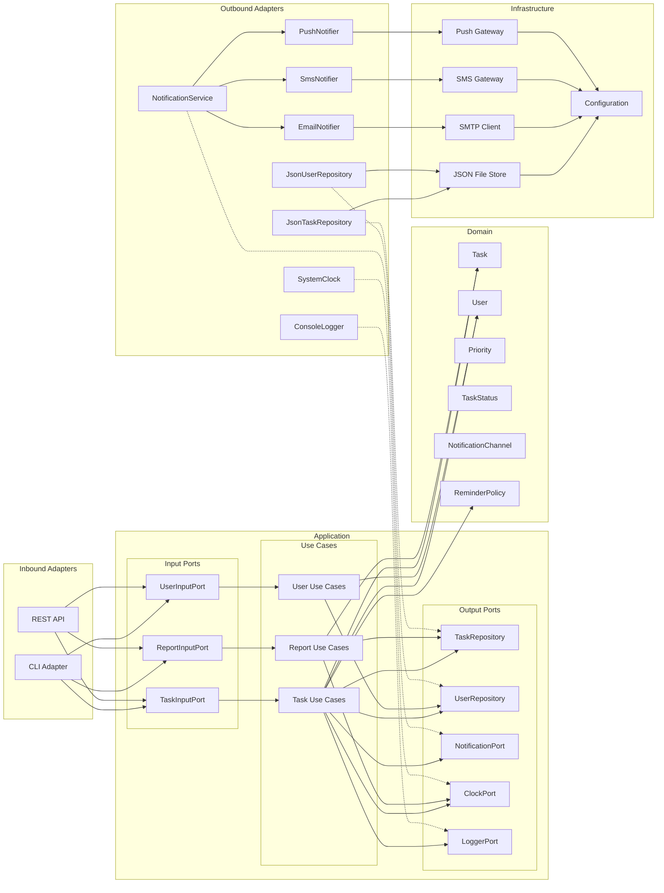

```mermaid
flowchart LR

%% ----------------------------
%% Inbound Adapters
%% ----------------------------
subgraph Inbound["Inbound Adapters"]
    CLI["CLI Adapter"]
    REST["REST API"]
end

%% ----------------------------
%% Application
%% ----------------------------
subgraph App["Application"]

subgraph InputPorts["Input Ports"]
    TaskInput["TaskInputPort"]
    UserInput["UserInputPort"]
    ReportInput["ReportInputPort"]
end

subgraph UseCases["Use Cases"]
    TaskUC["Task Use Cases"]
    UserUC["User Use Cases"]
    ReportUC["Report Use Cases"]
end

subgraph OutputPorts["Output Ports"]
    TaskRepo["TaskRepository"]
    UserRepo["UserRepository"]
    NotificationPort["NotificationPort"]
    ClockPort["ClockPort"]
    LoggerPort["LoggerPort"]
end

end

%% ----------------------------
%% Domain
%% ----------------------------
subgraph Domain["Domain"]
    Task["Task"]
    User["User"]
    Priority["Priority"]
    TaskStatus["TaskStatus"]
    NotificationChannel["NotificationChannel"]
    ReminderPolicy["ReminderPolicy"]
end

%% ----------------------------
%% Outbound Adapters
%% ----------------------------
subgraph Outbound["Outbound Adapters"]
    JsonTaskRepo["JsonTaskRepository"]
    JsonUserRepo["JsonUserRepository"]

    NotificationService["NotificationService"]
    EmailNotifier["EmailNotifier"]
    SmsNotifier["SmsNotifier"]
    PushNotifier["PushNotifier"]

    SystemClock["SystemClock"]
    ConsoleLogger["ConsoleLogger"]
end

%% ----------------------------
%% Infrastructure
%% ----------------------------
subgraph Infra["Infrastructure"]
    JsonStore["JSON File Store"]
    SMTP["SMTP Client"]
    SMS["SMS Gateway"]
    PUSH["Push Gateway"]
    Config["Configuration"]
end

%% ----------------------------
%% Inbound -> Ports
%% ----------------------------
CLI --> TaskInput
CLI --> UserInput
CLI --> ReportInput

REST --> TaskInput
REST --> UserInput
REST --> ReportInput

%% ----------------------------
%% Ports -> Use Cases
%% ----------------------------
TaskInput --> TaskUC
UserInput --> UserUC
ReportInput --> ReportUC

%% ----------------------------
%% Use Cases -> Domain
%% ----------------------------
TaskUC --> Task
TaskUC --> User
TaskUC --> ReminderPolicy

UserUC --> User
ReportUC --> Task

%% ----------------------------
%% Use Cases -> Output Ports
%% ----------------------------
TaskUC --> TaskRepo
TaskUC --> UserRepo
TaskUC --> NotificationPort
TaskUC --> ClockPort
TaskUC --> LoggerPort

UserUC --> UserRepo

ReportUC --> TaskRepo
ReportUC --> ClockPort

%% ----------------------------
%% Adapter implementieren Ports
%% ----------------------------
JsonTaskRepo -.-> TaskRepo
JsonUserRepo -.-> UserRepo

NotificationService -.-> NotificationPort
SystemClock -.-> ClockPort
ConsoleLogger -.-> LoggerPort

%% ----------------------------
%% Technische Abhängigkeiten
%% ----------------------------
NotificationService --> EmailNotifier
NotificationService --> SmsNotifier
NotificationService --> PushNotifier

JsonTaskRepo --> JsonStore
JsonUserRepo --> JsonStore

EmailNotifier --> SMTP
SmsNotifier --> SMS
PushNotifier --> PUSH

JsonStore --> Config
SMTP --> Config
SMS --> Config
PUSH --> Config
```
